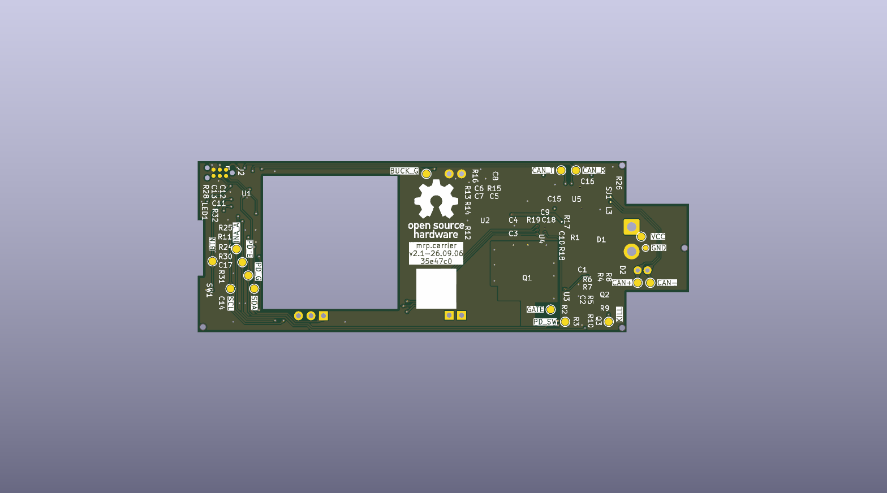
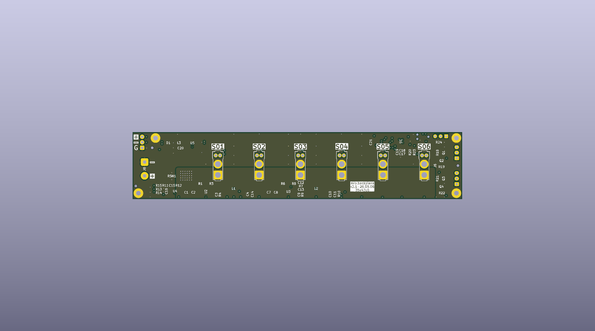
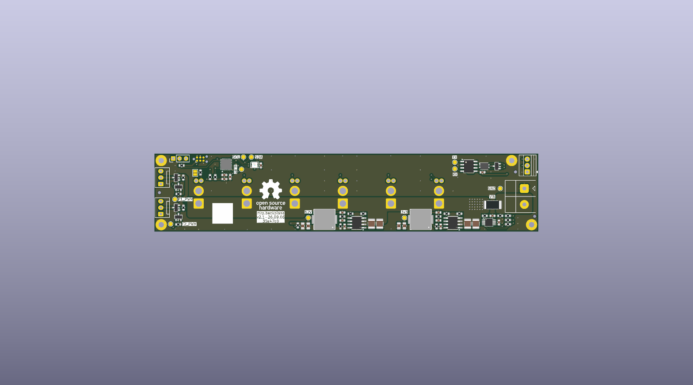
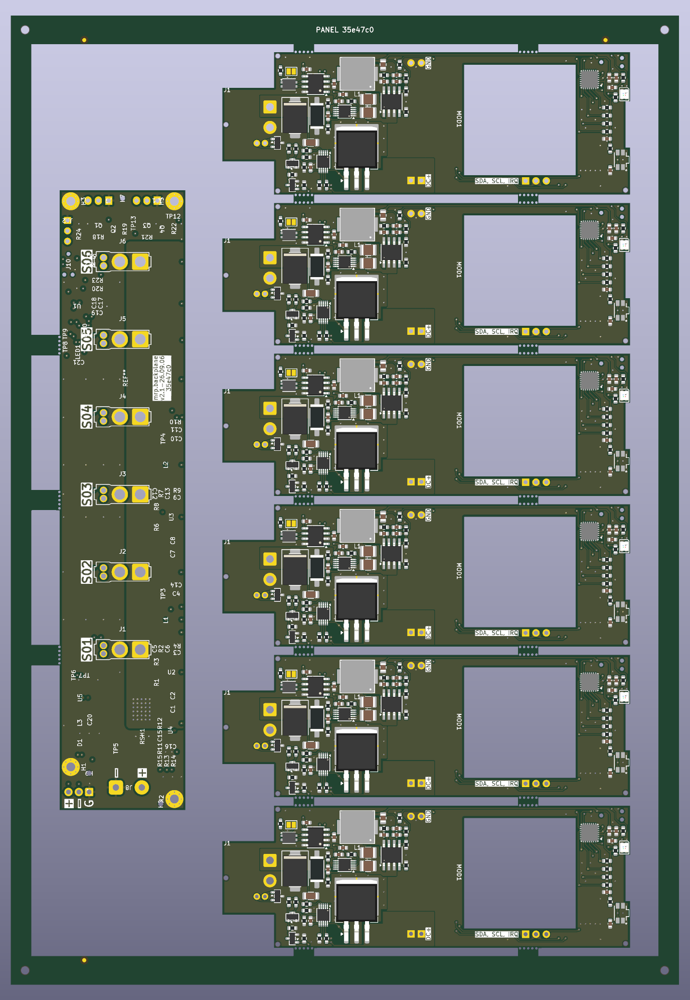

# Carrier and backplane fabrication panel

The current build commands and artifact paths are in the
[release tooling guide](../.kibot/release/README.md). The architecture and Mermaid
diagrams are in [pcb-release-pipeline-refactor.md](pcb-release-pipeline-refactor.md).

```sh
mise run release:setup
mise run docs:pcb-renders
mise run docs:pcb-iboms
mise run panel:build
```

Preview WebPs are written to the Hugo page bundles for the carrier, backplane,
and hardware section. `panel:build` uses the new gated pipeline and publishes to
`releases/pcb-release/`. The original Rev A pipeline and generated package are
retained for comparison while the new full release receives acceptance testing.

## Historical Rev A documentation renders

The images below are the previously committed renders, converted losslessly to
WebP. Their original source revision is retained in
[the historical manifest](assets/generated/pcbs/renders.json). Current previews
and manifests belong to the Hugo content bundles instead.

### Carrier Rev A




[Open the carrier InteractiveHtmlBom](assets/generated/pcbs/carrier-rev-a-ibom.html)

### Backplane prototype Rev A





[Open the backplane prototype InteractiveHtmlBom](assets/generated/pcbs/backplane-prototype-rev-a-ibom.html)

### Six-carrier/one-backplane panel



The Rev A customer panel combines six carrier PCBs and one backplane-prototype
PCB into one fabrication and top-side assembly unit. The generated result is
163.800 x 237.350 mm, so it fits both vendors considered:

- JLCPCB recommends keeping an assembly panel at or below 250 x 250 mm.
- PCBWay states an assembly-panel range of 50 x 50 mm through 330 x 530 mm.

The source boards have different copper weights. The common panel therefore
uses the heavier backplane construction: four layers, 1.6 mm FR-4, ENIG,
2 oz outer copper, and 1 oz inner copper. Both vendors advertise this copper
combination, but it must be confirmed during engineering review before payment.

## Historical Rev A source authority

In the original Rev A implementation, `panel:build` first regenerated the carrier and backplane production
packages. Both production checks must pass before panelization starts. The
builder verifies that each validation manifest identifies the selected Git
revision, consumes the freshly exported BOMs, and materializes both KiCad boards
from that revision for panel geometry. The mise tasks select the checked-out
`HEAD`; a deployment can set `PANEL_GIT_HASH` to another commit available in the
checkout, provided the generated production packages identify that same commit.
This keeps the panel sources, assembly data, board identity text, documentation
renders, and provenance metadata aligned.

KiKit applies a unique prefix to every reference and net. The final assembly
placement count is derived from the released carrier and backplane BOMs, so it
tracks design changes without a duplicated hard-coded total.

The panel, both Gerber exports, and the position file use the same absolute
origin. A 1 mm positive coordinate margin keeps plotted edge strokes away from
negative Gerber coordinates while preserving origin agreement between KiKit's
JLCPCB and PCBWay exporters.

The mise task passes the current Git short hash through `PANEL_GIT_HASH`. The
generator validates it, uses it to materialize the source files, and places
`PANEL <hash>` on the top process rail on `F.SilkS`. Baking the resolved value
into the generated PCB is intentional:
KiCad supports `${GIT_HASH}` project text variables and `kicad-cli -D`
overrides, but KiKit's vendor fabrication commands do not expose that override.

Board identity text uses native KiCad project text variables. The editable
defaults live in each board's `.kicad_pro`; for example, the backplane uses
`PROJECT_FAMILY`, `BOARD_NAME`, `BOARD_VERSION`, `BUILD_DATE`, and
`SHORT_HASH`. Its working-copy defaults render as:

```text
mrp.backplane
v2.1-YY.MM.DD
UNRELEASED
```

For a variable-bearing board, the panel builder deterministically replaces
`BUILD_DATE` with the build revision's commit date and `SHORT_HASH` with that
revision. It bakes those values before
KiKit copies the board, so the standalone renders, panel PCB, and Gerbers all
agree. Use `-D KEY=VALUE` for a shared override, or
`--carrier-define-var KEY=VALUE` / `--backplane-define-var KEY=VALUE` for a
board-specific override. Explicit overrides take precedence over both project
defaults and the automatically derived date/hash.

## Mechanical design

The backplane is rotated 90 degrees at the left of a vertical column of six
carriers. Routed separation is at least 2 mm. Five-millimetre breakaway tabs use
0.6 mm non-plated mouse-bite holes on 0.95 mm pitch, leaving 0.35 mm between
holes. The perimeter rails carry four 2 mm non-plated tooling holes and three
1 mm copper fiducials with 2 mm mask openings.

The carrier release includes two non-plated holes attached to the DNP `MOD1`
footprint outside its nominal board outline. The wider horizontal panel gap is
deliberate: it leaves those holes in routed waste instead of placing them in a
neighbouring PCB or rail.

## Vendor setup

For either vendor, order the supplied customer panel without vendor
re-panelization and declare two different designs. Order quantity is the number
of complete panels, not the number of individual daughterboards. Upload the
nested Gerber ZIP for PCB fabrication, then the vendor-specific `BOM.csv` and
`positions.csv` for top-side assembly.

For JLCPCB, select the complete panel BOM/CPL workflow and prefer Standard PCBA
so the non-default copper construction receives engineering review. For PCBWay,
submit `positions.csv` as the centroid/pick-and-place file. Some source BOM
entries do not include an explicit manufacturer and MPN. The PCBWay BOM retains
the released LCSC part number and flags these rows for confirmation rather than
inventing sourcing data.

Vendor references checked for this design:

- [JLCPCB PCB assembly capabilities](https://jlcpcb.com/capabilities/pcb-assembly-capabilities)
- [JLCPCB mouse-bite panelization guide](https://jlcpcb.com/blog/mouse-bite-panelization-guide)
- [JLCPCB process-edge and tooling-hole specification](https://jlcpcb.com/help/article/specifications-for-adding-process-edges-and-positioning-holes)
- [JLCPCB copper-weight capability](https://jlcpcb.com/help/article/jlcpcb-copper-weight)
- [JLCPCB different-design fee rules](https://jlcpcb.com/help/article/in-what-cases-will-there-be-charged-extra)
- [JLCPCB complete BOM/CPL upload guidance](https://jlcpcb.com/help/article/common-bom-and-cpl-matching-issues-and-explanations)
- [PCBWay assembly panel requirements](https://www.pcbway.com/pcb_prototype/Panel_Requirements_for_Assembly.html)
- [PCBWay rails, fiducials, and tooling holes](https://www.pcbway.com/helpcenter/design_instruction/PCB_Panelization__Breakaway_Rails__Fiducial_Marks__Tooling_Holes.html)
- [PCBWay assembly-file requirements](https://www.pcbway.com/helpcenter/pcb_assembly_ordering/What_files_are_requested_for_assembly_production_.html)
- [PCBWay fabrication tolerances](https://www.pcbway.com/pcb_prototype/PCB_Manufacturing_tolerances.html)

## Validation

The build checks for all four copper layers, masks, top silkscreen, edge cuts,
and plated/non-plated drill files in both Gerber archives. It also verifies one
position for every released BOM reference, 135 mouse-bite holes, four tooling
holes, and three fiducials.

KiCad DRC reports zero unconnected items and no copper-clearance, drill-
clearance, or outline failures. It still reports inherited release-board
courtyard, silkscreen, and library warnings/errors. The panel-created DRC items
are mouse-bite holes inside the courtyard of DNP `MOD1`; they do not intersect
copper or another drill. `validation.json` records the exact generated counts.
