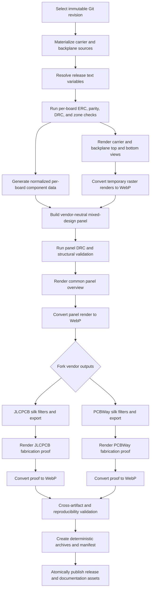
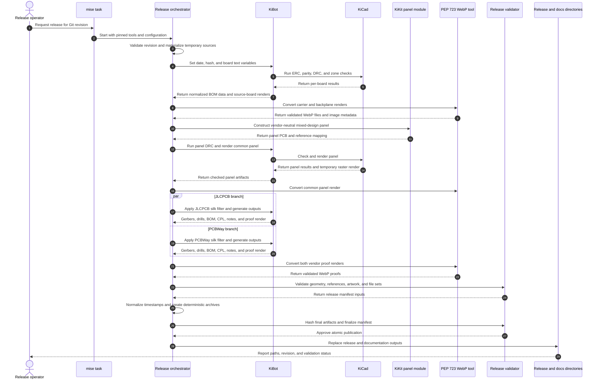

# PCB release pipeline refactor

Status: initial implementation available. The executable entry point is
`scripts/build_pcb_release.py`; commands and current limitations are documented
in the [release tooling guide](../.kibot/release/README.md). Full mixed-panel
release validation remains gated on the carrier DRC errors, generated-panel
rule/refill reconciliation, and vendor artwork registration. Preview rendering
and both vendors' standalone CAM exports have been exercised against the real
boards. See the release tooling guide's acceptance status for the outstanding
panel-integration findings; no fabrication-ready mixed-panel release is claimed.

This refactor moves PCB release generation toward a KiBot-centered pipeline,
while retaining custom code where the release has repository-specific needs.
It also makes board and panel renders first-class documentation artifacts for
the Hugo site. All committed raster images produced by this pipeline will be
WebP files; temporary PNGs or other intermediate formats stay in the build
workspace.

The original panel geometry and historical artifacts remain documented in
[`carrier-backplane-panel.md`](carrier-backplane-panel.md) and
[`scripts/README.md`](../scripts/README.md).

## Goals

- Build every artifact from one immutable Git revision.
- Run electrical and manufacturing checks before publishing anything.
- Generate individual-board images before panelization, a common panel image,
  and vendor-specific fabrication proofs.
- Keep vendor proof images beside the release for review, but outside the ZIP
  uploaded to the fabricator.
- Publish only WebP raster images to the repository and Hugo content tree.
- Use KiBot for standard KiCad checks and exports, KiKit for panel geometry,
  and small, testable scripts for repository-specific policy.
- Make vendor-specific silkscreen content explicit and verifiable.
- Preserve stable output names, provenance manifests, and canonical CAM/ZIP
  timestamps. Ray-traced image bytes can vary between runs.

This proposal does not change board geometry, design rules, fabrication
capabilities, or component selection. It also does not require vendor proof
images to be part of the manufacturing upload.

## End-to-end flow



## Responsibility boundaries

| Area | Proposed owner | Responsibility |
| --- | --- | --- |
| Tool versions and entry points | `mise` | Pin and invoke Python/uv, KiCad, KiBot, KiKit, and documentation tools. |
| Standard board checks and exports | KiBot and KiCad CLI | KiBot runs checks and CAM/assembly exports; KiCad CLI supplies source-board 3D renders and an independent BOM check. |
| Panel construction | KiKit plus a project panel module | Mixed-design placement, rotations, tabs, rails, tooling holes, fiducials, reference/net prefixes, and panel text. |
| Vendor variants | Container worker and KiBot configurations | Filter tagged padless artwork on disposable panel copies, then export with vendor templates. |
| Release coordination | Thin Python orchestrator | Resolve the revision, create the isolated workspace, order phases, stop on failures, and publish atomically. |
| Image normalization | PEP 723 Python tool | Convert temporary renderer output to deterministic WebP and verify image properties. |
| Release policy | Python validator | Check file sets, references, geometry, vendor artwork, manifests, hashes, and ZIP contents. |

The boundary is intentional: declarative KiBot configuration should handle
normal KiCad output behavior, while Python should handle policy that spans
multiple boards, tools, or vendor packages. Panel geometry remains custom
because the release combines different board designs in a fixed physical
arrangement.

Implemented file boundaries are:

- `scripts/build_pcb_release.py`: release orchestration only;
- `.kibot/release/`: checks, normalized BOM/CPL, proofs, and vendor CAM configs;
- `scripts/pcb_release_worker.py`: container operations and board-only artwork filtering;
- `scripts/panel_layout.py`: the reusable KiKit panel callback/module;
- `scripts/convert_pcb_render.py`: the PEP 723 WebP converter; and
- `scripts/validate_pcb_release.py`: repository release policy.

The important constraint is that panel layout,
image conversion, validation, and orchestration remain independently testable.

## Ordered release phases

### 1. Select the source revision

Resolve `HEAD` or an explicit release commit to a full Git object ID. Record
its short hash and UTC commit date. Always archive the selected commit;
working-tree PCB changes are never implicit build inputs. Snapshot the running
pipeline scripts/configuration once and record their hashes as tooling inputs.

### 2. Create an isolated build workspace

Materialize every tracked schematic, board, project file, custom library, and
3D model from that exact revision. Generated files must never depend on an
uncommitted KiCad file from the caller's worktree.

### 3. Resolve release variables

Apply repository-wide and board-specific identity variables before checking,
rendering, or panelizing. `PROJECT_FAMILY`, `BOARD_NAME`, `BOARD_VERSION`,
`BUILD_DATE`, and `SHORT_HASH` should therefore agree across standalone
renders, panel source, Gerbers, and manifests.

### 4. Validate each source board

Run ERC, schematic/PCB parity, DRC, unconnected-item checks, and zone refill.
Validate BOM/DNP/placement policy before panel construction. A source-board
failure stops both vendor branches.

### 5. Export source-board data and images

Generate normalized component data and render the top and bottom of each PCB.
This is the first image checkpoint and produces the most useful Hugo images:

- `site/content/latest/hardware/modules/carrier/carrier.webp`;
- `site/content/latest/hardware/modules/carrier/carrier-bottom.webp`;
- `site/content/latest/hardware/backplane/backplane.webp`; and
- `site/content/latest/hardware/backplane/backplane-bottom.webp`.

The renderer may use a temporary format internally. The publishing boundary
accepts only validated WebP files.

### 6. Construct one vendor-neutral panel

Use the project KiKit layout module to place six carriers and one backplane,
add rails and breakaways, prefix references/nets, and preserve one absolute
origin. Do not apply vendor-specific silkscreen filtering yet.

### 7. Validate and render the common panel

Run panel DRC and structural checks, then render an overview such as
`site/content/latest/hardware/panel.webp`. This second image checkpoint is useful
for both release review and the Hugo site.

### 8. Fork vendor variants

Each vendor branch starts from the checked common panel:

- PCBWay keeps the `WayWayWay` job-number marker and PCBWay logo, and removes
  the JLCPCB barcode target.
- JLCPCB keeps the 8 x 8 mm barcode target, and removes the PCBWay marker and
  logo.

The conditional artwork should be represented by uniquely identifiable,
padless board footprints with `ReleaseVendor` and `ReleaseArtwork` fields.
The container worker selects the intended content before KiBot exports it.
Missing required artwork causes the vendor branch to fail.

### 9. Render vendor proofs

Render both sides of the final filtered PCB after vendor filters are applied.
Examples are `jlcpcb-top.webp` and `pcbway-bottom.webp`. These PcbDraw views are
artwork proofs, not simulations of Gerber solder-mask subtraction. Inspect the
actual plotted silk in GerbView too. These files belong in the release review
directory and manifest, not in the fabricator upload ZIP.

The proofs should make it easy to verify that exactly one vendor's artwork is
present, identity text is resolved, reference text remains readable, and no
job-number or barcode target was accidentally sent to the other vendor.

### 10. Generate and validate manufacturing outputs

Generate Gerbers, drills, IPC-D-356, BOM, and placement files. Validate layer
sets, design/reference counts, the common coordinate origin, board/panel bounds,
vendor column names, DNP policy, and the absence of documentation images from
upload archives.

### 11. Canonicalize, package, and publish

Normalize timestamps and ordering, create deterministic archives, hash final
artifacts, write the manifest, and atomically replace release and documentation
outputs. Publication happens only after both vendor branches pass.

## Release sequence



## WebP-only image contract

The repository should commit only `.webp` raster output from PCB release jobs.
The rendering tool is allowed to generate PNG in a temporary directory when
that is the most reliable KiCad, KiBot, or PcbDraw output path, but the PNG is
an intermediate and must not be copied into the repository or release tree.

The converter should be a single-file Python script with PEP 723 inline
metadata and an exact-pinned Pillow dependency. It should be runnable without
a maintained virtual environment, for example:

```sh
uv run scripts/convert_pcb_render.py input.png output.webp
```

The conversion contract should:

- preserve pixel dimensions and alpha transparency;
- use lossless WebP by default for line art, text, and solder-mask boundaries;
- strip incidental source metadata;
- write to a temporary sibling and atomically rename the completed file;
- reopen the WebP and verify its format, dimensions, and alpha behavior;
- report the dimensions and SHA-256 for inclusion in `renders.json`; and
- reject a non-`.webp` destination.

Keeping conversion separate from rendering makes the image policy independent
of which KiCad-compatible renderer is used. It also gives CI one simple place
to enforce that no generated `.png`, `.jpg`, or `.jpeg` file is committed.

Stable filenames are preferable for Hugo URLs. The exact Git revision,
resolved identity strings, renderer version, image dimensions, and SHA-256
belong in `renders.json` rather than in every filename. During cutover, replace
the existing committed PNGs and update all Markdown/Hugo references together.
That conversion is included in the initial implementation. Hugo publication
updates only named generated files inside each content bundle, preserving its
Markdown and other assets.

## Proposed artifact layout

```text
build/pcb-release/
  common/
    panel.kicad_pcb
    validation/
  jlcpcb/
    upload/
      gerbers.zip
      BOM.csv
      positions.csv
    proofs/
      jlcpcb-top.webp
      jlcpcb-bottom.webp
  pcbway/
    upload/
      gerbers.zip
      BOM.csv
      positions.csv
    proofs/
      pcbway-top.webp
      pcbway-bottom.webp
  manifest.json

site/content/latest/hardware/
  _index.md
  panel.webp
  renders.json
  backplane/
    index.md
    backplane.webp
    backplane-bottom.webp
    renders.json
  modules/carrier/
    _index.md
    carrier.webp
    carrier-bottom.webp
    renders.json
```

The release validator should explicitly compare each vendor upload ZIP against
an allowlist. Proofs, manifests, logs, renders, and source KiCad files remain
available for review without being uploaded to the fabricator.

## Migration status

Steps 1–6 and 8 below have an initial implementation. The old production
exporter remains as a comparison path. Step 7 has passed standalone backplane
CAM generation and both boards' BOM/CPL checks; full mixed-panel CAM equivalence
and step 9 remain pending the source/artwork gates. Preview renders are always
labeled unchecked and cannot produce fabrication archives.

1. Extract the current mixed-design panel geometry into a tested KiKit module
   without changing the manufactured result.
2. Introduce shared KiBot checks and compare their outputs with the current
   production exporter.
3. Add the PEP 723 converter and WebP validation, initially alongside the PNG
   documentation output.
4. Add stable source-board and common-panel WebP publication.
5. Model vendor-only artwork as filterable padless footprints and add
   vendor-specific proof renders.
6. Move standard Gerber, drill, BOM, and placement generation to KiBot while
   retaining cross-artifact validation in project code.
7. Compare old and new Gerber geometry, drill sets, BOMs, placements, panel
   bounds, and reference counts for the same commit.
8. Switch Markdown and Hugo references to WebP and remove committed PNG output.
9. Retire superseded orchestration only after reproducibility and vendor upload
   checks pass for both branches.

## Acceptance criteria

- A release is traceable to one immutable Git commit.
- Source-board checks complete before panelization.
- Both vendor variants derive from the same validated common panel.
- PCBWay-only and JLCPCB-only artwork never coexist in one vendor output.
- Top/bottom board views, the common panel view, and both vendor proofs are
  valid WebP images.
- No generated PNG/JPEG is committed or included in a published release.
- Proof images are absent from fabricator upload ZIPs.
- BOM, placement, panel references, and design counts agree.
- Repeating CAM packaging for the same input files yields identical archives.
  Full mixed-panel CAM reproducibility still needs acceptance testing; upstream
  ray-traced images can vary and are fingerprinted individually.
- Publication uses atomic file/directory renames and rolls back on I/O failure;
  it is not crash-atomic across multiple content bundles.

## Mermaid validation

The raw Mermaid blocks are the only diagram sources retained in the
repository. Validate them during review by extracting each block to a temporary
`.mmd` file and rendering it outside the repository. Mermaid CLI can be loaded
ephemerally through mise:

```sh
mise x npm:@mermaid-js/mermaid-cli -- \
  mmdc --input /tmp/release-flow.mmd --output /tmp/release-flow.svg
```

CI should pin an exact Mermaid CLI version so a documentation-only dependency
update cannot silently change rendering behavior. The temporary SVG files are
lint artifacts and should not be committed.

## Primary tool references

- [KiBot outputs and preflights](https://kibot.readthedocs.io/en/latest/configuration.html)
- [KiBot panelize output](https://kibot.readthedocs.io/en/latest/configuration/outputs/panelize.html)
- [KiBot manufacturer imports](https://kibot.readthedocs.io/en/latest/configuration/extends.html)
- [KiBot text-variable preflight](https://kibot.readthedocs.io/en/latest/configuration/preflights/set_text_variables.html)
- [KiKit panelization scripting](https://yaqwsx.github.io/KiKit/latest/panelization/python_api/)
- [PEP 723 inline script metadata](https://peps.python.org/pep-0723/)
- [Mermaid CLI](https://github.com/mermaid-js/mermaid-cli)
