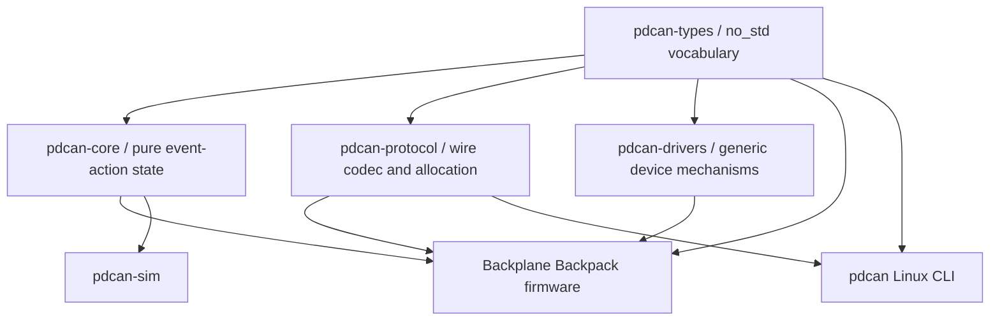

# Backplane Backpack Firmware Architecture

## Workspace Boundaries



`pdcan-core` has no Embassy, hardware, SocketCAN, flash, wall-clock, or logging
dependency. Hardware and host adapters translate between semantic events/actions
and their mechanisms.

## Board Selection

Firmware builds require an explicit board feature:

```text
cargo xtask firmware build --board rev-a --release
```

Rev A embeds hardware revision 1, supported-port mask `0x3F`, mux mappings for ports
0 through 5, 3-wire fan default, the 1/2 Mbit CAN-FD configuration, and the reserved
configuration-flash boundary. A future Rev B gets a separate module and mutually
exclusive build feature only after its electrical definition exists.

## State-Derived Action Scheduling

The core records pending desired work and the firmware pulls actions while the
relevant executor has capacity. Emergency disables are selected before persistence,
which is selected before ordinary policy application. Each port has at most one
in-flight PD operation.

Operations carry an `OperationId` and `SlotEpoch`. Removing/replacing a module
increments its epoch; a late completion can no longer mutate current state and is
recorded diagnostically.

## Persistent Emergency State

Runtime emergency state becomes active immediately. Setting or clearing the
durable latch uses a versioned configuration action. Runtime clearing occurs only
after the matching persistence completion succeeds. Stale persistence completions
are ignored and counted. A failed clear leaves the runtime latch active.

The initial core tests cover emergency priority, durable-clear ordering,
unsupported Rev A ports, blocked enable policy while latched, and stale operation
completion handling.

## Hardware Bring-Up Boundary

The embedded binary now cross-compiles the intended STM32C092FCP6 resource map:

| Owner | Rev A resources | Responsibility |
| --- | --- | --- |
| `pd_bus_task` | I2C2, DMA1 ch. 1/2, PA3 | Mux and PD bus |
| `can_task` | FDCAN1, PA11/PA12, PA4 | CAN-FD receive |
| `config_task` | final 8 KiB of flash | Durable journal |
| `fan_task` | TIM2/PA0, TIM17/PA1 | fan PWM and tach capture |
| `status_task` | TIM15/PA2, DMA1 channel 3 | WS2812 GRB waveform output |
| `supervisor_task` | IWDG | progress-window watchdog feeding |
| `controller_task` | no peripheral | State and arbitration |

TIM3 is reserved for Embassy timekeeping. The firmware configures the 48 MHz HSI,
FDCAN at 1 Mbit/s nominal and 2 Mbit/s data with BRS, I2C2 at 100 kHz, a
full-speed three-wire fan boot state, and the checked-in flash boundary. The CAN
task is receive-only in this slice; operational command decoding remains behind
the one-port protocol-freeze spike.

These statements describe checked and cross-compiled configuration, not measured
hardware behavior. The required measurements and fault tests are tracked in
[`hardware-validation.md`](hardware-validation.md).

## PD Bus Scheduling and Recovery

The bus task uses an absolute 250 ms provisional probe deadline rather than
restarting a relative timer after every ordinary command. Sustained ordinary
traffic can delay a probe only by the currently executing bounded transaction,
not forever. Emergency work has a separate queue that is always polled first.
The logical controller uses independent round-robin cursors for emergency and
ordinary policy work so a failed low-numbered port cannot monopolize retries.

Expected NACKs from empty slots do not pulse mux reset. Other transport failures
take the explicit TCA9548A reset path. A mux reset does not reset the downstream
SW3538; if an interrupted transaction leaves its register bank unknown, firmware
preserves the last presence state and fails operations rather than guessing. A
safe bank-recovery sequence is an explicit one-port HIL blocker.

## Persistence Journal

The final 8 KiB is split into two 4 KiB slots. Each fixed-size record contains a
magic value, format version, payload length, sequence, all eight port policies,
node and fan configuration, the emergency latch, reserved bytes, and CRC32. The
payload is written first and an aligned eight-byte commit marker is programmed
last. Boot selects the newest valid committed slot with wrapping sequence
comparison; an invalid or torn replacement leaves the prior slot authoritative.

The emergency latch uses the same journal. Runtime entry is immediate, while a
successful latch/clear response is allowed only after the matching durable
completion. Host tests reconstruct the store across simulated complete power
loss and injected payload/commit write failures.

## Provisional Values

The following values exist to make ownership and failure behavior executable,
not because they have been characterized:

- 100 ms I2C transaction timeout;
- 250 ms logical probe cadence, giving roughly two seconds per eight-port sweep;
- 100 ms retry delay after a failed command when no other PD work is queued;
- 8 s watchdog timeout and its subsystem progress deadlines;
- 30 Hz three-wire and 25 kHz four-wire fan PWM;
- tach-to-RPM and fan-stall thresholds; and
- WS2812 duty ratios and reset timing at the PA2 waveform.
