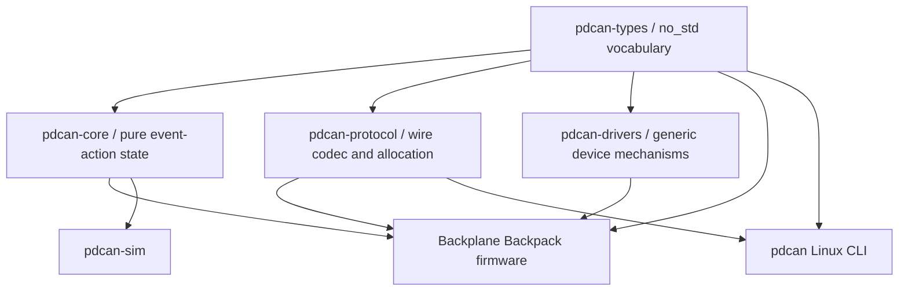

# Backplane Backpack Firmware Architecture

## Workspace Boundaries



`pdcan-core` has no Embassy, hardware, SocketCAN, flash, wall-clock, or logging
dependency. Hardware and host adapters translate between semantic events/actions
and their mechanisms.

## Board Selection

Firmware builds require an explicit board feature:

```text
cargo xtask firmware build --board rev-a --release
```

Rev A embeds hardware revision 1, supported-port mask `0x3F`, mux mappings for ports
0 through 5, 3-wire fan default, the 1/2 Mbit CAN-FD configuration, and the reserved
configuration-flash boundary. A future Rev B gets a separate module and mutually
exclusive build feature only after its electrical definition exists.

## State-Derived Action Scheduling

The core records pending desired work and the firmware pulls actions while the
relevant executor has capacity. Emergency disables are selected before persistence,
which is selected before ordinary policy application. Each port has at most one
in-flight PD operation.

Operations carry an `OperationId` and `SlotEpoch`. Removing/replacing a module
increments its epoch; a late completion can no longer mutate current state and is
recorded diagnostically.

## Persistent Emergency State

Runtime emergency state becomes active immediately. Setting or clearing the
durable latch uses a versioned configuration action. Runtime clearing occurs only
after the matching persistence completion succeeds. Stale persistence completions
are ignored and counted. A failed clear leaves the runtime latch active.

The initial core tests cover emergency priority, durable-clear ordering,
unsupported Rev A ports, blocked enable policy while latched, and stale operation
completion handling.

## Hardware Bring-Up Boundary

The current embedded binary proves the checked-in linker map, target selection,
Rev A compile-time definition, and resource-budget reporting. It deliberately
does not pretend that clocks, FDCAN timing, I2C cancellation, watchdog windows,
flash timing, or LED/fan timers have been validated without hardware. Those
mechanisms are the next vertical slice and will use Embassy with TIM3 reserved as
its time source.
