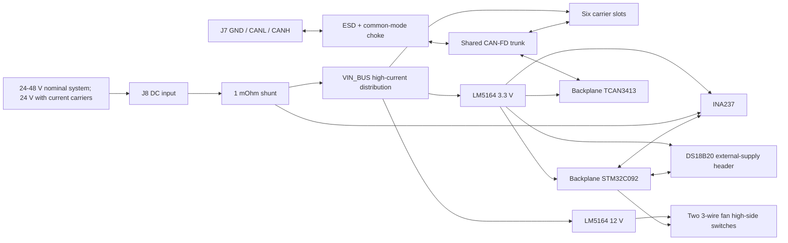

# System Overview

The second-generation design combines the controller, six-slot power
distribution, current monitoring, dual-fan control, and external temperature
sensor interface on one backplane. Each carrier has its own STM32 and CAN-FD
transceiver; there is no backplane-to-carrier I2C bus.

## Electrical Authority

Where the boards overlap, the carrier is authoritative. The backplane therefore
uses the carrier's STM32C092GCU6, TCAN3413DR, INA237AIDGSR, CAN choke and ESD
parts, and slot connector/pinout.

The finalized backplane PCB is authoritative for the board outline, airflow
cutouts, mounting features, and the six slot-connector footprints and
placement. Its consolidated circuitry is synchronized, placed, and routed.
Electrical ratings still depend on first-article validation.

## Communications

CAN-FD is the only communication interface between the backplane and carriers.
One protected three-position screw-terminal connection joins the external bus.
Optional 120 ohm termination is fitted but normally open. The backplane does not
duplicate ESD arrays at each carrier slot because every carrier retains its own
connector-side protection.

I2C is strictly local to the backplane STM32 and its INA237 current sensor.

## Power Targets

The backplane is designed for a **24–48 V nominal system**. The current SW3538
carrier limits the first revision to **24 V nominal, 30 V maximum input**;
48 V operation requires a second-generation carrier with a suitably rated
module and protection. All slots receive the same unswitched bus voltage, so
do not mix current carriers onto a 48 V-powered backplane. No nominal input
below 24 V is specified; supply-tolerance and startup margins still require
qualification at the carrier connector.

The first population targets a nominal 24 V input and no more than 100 W output
per slot, or approximately 30 A total backplane input current for six loaded
slots. The board measures aggregate input current rather than switching or
limiting individual slots.

The longer-term hardware goal is 48 V nominal input with a new carrier revision
for up to 240 W per slot. That goal is not a released rating until the raw-input
protection, shunt/current path, connector and copper temperatures, transients,
regulators, carrier hot-swap path, and full-system first-article behavior have
been validated.

## Cooling and Temperature

A dedicated LM5164 generates 12 V for two independently switched 3-wire fan
connectors. The STM32 controls each high-side PMOS and reads both tach outputs.
The two channels share the regulator's 1 A output capability, so simultaneous
startup and stall loading must be validated with the selected fans.

An externally powered DS18B20 can be connected at J12 for remote air, heatsink,
or chassis-temperature measurement. The STM32 also contains an ADC-connected
internal die-temperature sensor, but that is not a substitute for a remotely
placed sensor. The backplane has one local status NeoPixel on PA1; there are no
per-slot NeoPixels.

Firmware uses the same STM32 target and bootloader on every board, with separate
backplane and carrier applications. The host commissions and controls nodes and
performs direct CAN firmware updates; a backplane never updates a carrier.
