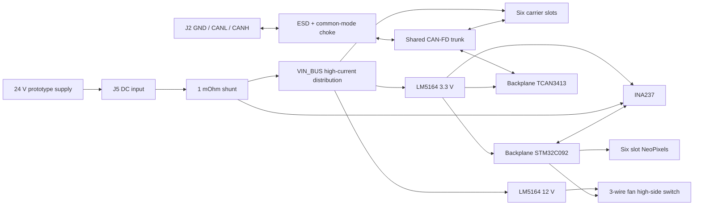

# System Overview

The second-generation design combines the controller, six-slot power
distribution, current monitoring, fan control, and status LEDs on one
backplane. Each carrier has its own STM32 and CAN-FD transceiver; there is no
backplane-to-carrier I2C bus.

## Electrical Authority

Where the boards overlap, the carrier is authoritative. The backplane therefore
uses the carrier's STM32C092GCU6, TCAN3413DR, INA237AIDGSR, CAN choke and ESD
parts, slot connector/pinout, and WS2812B-2020-V6 LED.

The prototype backplane PCB is authoritative for the board outline, airflow
cutouts, mounting features, and six slot-connector footprints and placement.
The consolidated schematic is complete, but it has not yet been synchronized
into that PCB; the current PCB is a mechanical base, not a fabrication-ready
electrical implementation.

## Communications

CAN-FD is the only communication interface between the backplane and carriers.
One protected three-position screw-terminal connection joins the external bus.
Optional 120 ohm termination is fitted but normally open. The backplane does not
duplicate ESD arrays at each carrier slot because every carrier retains its own
connector-side protection.

I2C is strictly local to the backplane STM32 and its INA237 current sensor. The
former TCA9548A mux, PCA9554 expander, per-slot I2C protection, and separate
backpack control boundary are superseded.

## Power Targets

The first population targets a nominal 24 V input and no more than 100 W output
per slot, or approximately 30 A total backplane input current for six loaded
slots. The board measures aggregate input current rather than switching or
limiting individual slots.

The longer-term hardware goal is approximately 48--50 V nominal input for up to
240 W per slot. That goal is not a released rating until the raw-input
protection, shunt/current path, connector and copper temperatures, transients,
regulators, carrier hot-swap path, and full-system first-article behavior have
been validated.

## Cooling and Status

A dedicated LM5164 generates 12 V for one 3-wire fan. The STM32 switches the
fan supply through a high-side PMOS and reads its tach output. Six daisy-chained
NeoPixels provide one status indicator per physical slot.

Firmware is intentionally outside the scope of this hardware reconciliation
and will be redesigned after the second-generation hardware stabilizes.
