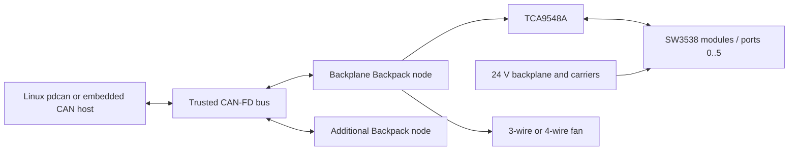

# System Overview

Mini Rack Power uses one or more Backplane Backpack controllers on a trusted
CAN-FD network. Each backpack manages the USB-C PD modules associated with one
backplane while the backplane carries the high-current nominal 24 V distribution.

The repository implements the backpack firmware, shared PDCAN protocol/domain
crates, a simulator, and the Linux `pdcan` tool. Firmware for other CAN hosts is
outside scope.

## Backplane Backpack

The active controller is based on an STM32C092FCP6 and provides:

- CAN-FD through a TCAN3413 transceiver;
- one TCA9548A mux and exclusive ownership of the downstream I2C bus;
- discovery, policy, monitoring, and best-effort control of SW3538 PD modules;
- configurable 3-wire/4-wire fan control and tachometer monitoring;
- a status LED; and
- SWD programming/debug access.

Firmware, protocol, persistent configuration, and simulation support eight
zero-based logical ports. Rev A has six physical downstream connectors, so it
advertises support for ports 0 through 5 and rejects ports 6 and 7 as unsupported.

## Backplane and Carrier

The backplane distributes the nominal 24 V supply to carrier slots. Each carrier
hosts one fixed-address SW3538 module. The backpack's I2C mux isolates those
identical addresses so only one downstream segment is selected at a time.

Module presence and USB-C partner/contract state are separate. A healthy
backpack may have no installed modules or may report failures for every module
while its controller, PD bus, and CAN reporting remain operational.

## Safety and Policy Boundary

Firmware rejects port policies above 20 V, 5 A, or 100 W and does not expose EPR
or the SW3538's proprietary 7 A mode. Rev A has no per-port MCU-controlled
high-side switch, so this is a firmware soft ceiling after module initialization,
not independent overcurrent protection.

The supported deployment sequence is to provision the backpack, install modules,
persist port policy, and only then attach loads. Emergency disable is a
highest-priority best-effort I2C operation. Its backpack-wide latch persists across
watchdog reset and complete power loss and requires an explicit operator
acknowledgment through `pdcan` before normal operation may resume.

## Superseded Architecture

The former central WT32 controller and daisy-chained I2C/LED controller
topology is superseded. Its hardware sources remain as project history, but
active firmware and interface documentation do not target it.
