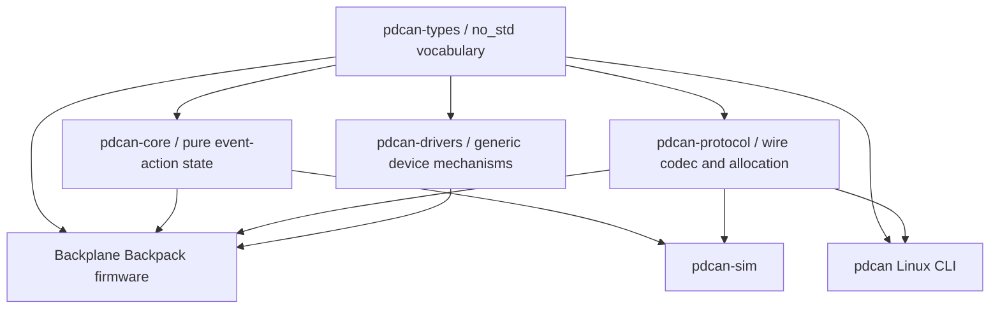

# Backplane Backpack Firmware Architecture

## Workspace Boundaries

All Rust sources, host tools, protocol docs, and build configuration live under
the repository's `firmware/` directory. Run Cargo commands from that directory;
see the [workspace README](../../README.md) for setup. The board descriptions
below refer to the retained legacy backpack targets, not the consolidated
backplane hardware.



`pdcan-core` has no Embassy, hardware, SocketCAN, flash, wall-clock, or logging
dependency. Hardware and host adapters translate between semantic events/actions
and their mechanisms.

## Board Selection

Firmware builds require an explicit board feature (run from `firmware/`):

```text
cargo xtask firmware build --board rev-a --release
cargo xtask firmware build --board rev-b --release
```

Rev A embeds hardware revision 1, supported-port mask `0x3F`, mux mappings for ports
0 through 5, 3-wire fan default, the 1/2 Mbit CAN-FD configuration, and the reserved
configuration-flash boundary. Rev B embeds hardware revision 2 and the same
six-port/mux capability plus the prototype's PCA9554 `P0..P5` input-power mapping.
The TCA9548A mux and PCA9554 power expander both reside on the main backplane and
share the backpack's upstream I2C2 bus. The Rev B backpack/backplane connector
carries only duplicated 3.3 V/ground plus SDA/SCL; mux selection, FET control,
and every slot-local signal remain behind that boundary on the backplane.

## State-Derived Action Scheduling

The core records pending desired work and the firmware pulls actions while the
relevant executor has capacity. Rev B all-off PCA9554 work is selected first,
followed by per-port gate-off, Rev A I2C emergency work, persistence, all-off
expander initialization, gate-on, and ordinary policy application. Gate-on work
which enables a newly changed policy cannot run until persistence durably covers
that change. Each port has at most one correlated gate or PD operation.

Operations carry an `OperationId` and `SlotEpoch`. Removing/replacing a module
increments its epoch; a late completion can no longer mutate current state and is
recorded diagnostically.

## Persistent Emergency State

Runtime emergency state becomes active immediately. Setting or clearing the
durable latch uses a versioned configuration action. Runtime clearing occurs only
after the matching persistence completion succeeds. Stale persistence completions
are ignored and counted. A failed clear leaves the runtime latch active.

Ordinary persistent host mutations are serialized so each success describes the
value that actually became durable. Emergency disable may preempt an in-flight
clear. In that case the clear receives `EMERGENCY_LATCHED`, runtime remains
latched, and a new durable-latch write is queued. As with every flash-backed event,
power loss before that new write completes can only recover the last committed
record; no emergency success response is emitted before the re-latch is durable.

The initial core tests cover emergency priority, durable-clear ordering,
clear/re-latch overlap, unsupported Rev A ports, blocked enable policy while
latched, and stale operation completion handling.

## Hardware Bring-Up Boundary

The embedded binary now cross-compiles the intended STM32C092FCP6 resource map:

| Owner | Resources | Responsibility |
| --- | --- | --- |
| `pd_bus_task` | I2C2, DMA1 ch. 1/2; legacy Rev A also uses PA3 | Upstream PCA9554 power control, TCA9548A selection, and PD transactions; Rev B has no mux-reset GPIO |
| `can_task` | FDCAN1, PA11/PA12, PA4 | CAN-FD RX/TX and codec boundary |
| `config_task` | final 8 KiB of flash | Durable journal |
| `fan_task` | TIM2/PA0, TIM17/PA1 | fan PWM and tach capture |
| `status_task` | TIM15/PA2, DMA1 channel 3 | WS2812 GRB waveform output |
| `supervisor_task` | IWDG | progress-window watchdog feeding |
| `controller_task` | no peripheral | State and arbitration |

TIM3 is reserved for Embassy timekeeping. The firmware configures the 48 MHz HSI,
FDCAN at 1 Mbit/s nominal and 2 Mbit/s data with BRS, I2C2 at 100 kHz, a
full-speed three-wire fan boot state, and the checked-in flash boundary.

The CAN task rejects non-FD/non-BRS traffic, strictly decodes control and
commissioning frames, and sends transport-neutral frames produced by the
controller service. The service reads the STM32 factory UID, performs the draft
claim window, suppresses normal traffic until commissioned/conflict-free, retains
a bounded request cache, and correlates persistent responses with configuration
revisions. Persistent success is never sent before flash completion.

The status task maintains a base health indication plus a bounded identify blink
overlay. The controller emits approximately 1 Hz heartbeats and requested port
state snapshots. Heartbeats carry the sticky RCC reset-cause flags captured at
boot plus monotonic uptime. Fields that depend on unverified SW3538 observation
remain unknown/zero rather than being inferred from hoped-for register semantics.

These statements describe checked and cross-compiled configuration, not measured
hardware behavior. The required measurements and fault tests are tracked in
[`hardware-validation.md`](hardware-validation.md).

## PD Bus Scheduling and Recovery

The bus task uses an absolute 250 ms provisional probe deadline rather than
restarting a relative timer after every ordinary command. Sustained ordinary
traffic can delay a probe only by the currently executing bounded transaction,
not forever. Emergency work has a separate queue that is always polled first.
The logical controller uses independent round-robin cursors for emergency and
ordinary policy work so a failed low-numbered port cannot monopolize retries.

Expected NACKs from empty slots are not bus-recovery events. Legacy Rev A may
pulse its PA3-connected TCA9548A reset after other transport failures. Rev B has
no reset signal across the backpack boundary, so it can only deselect channels,
allow the bounded I2C transaction to fail, and retry through normal scheduling.
Neither mechanism resets a downstream SW3538; if an interrupted transaction
leaves its register bank unknown, firmware preserves the last presence state and
fails operations rather than guessing. Safe backplane-local mux and SW3538 bank
recovery remain HIL blockers.

On Rev B, the bus task publishes a port as probeable only after its provisional
10 ms rail-settling delay. Gated-off ports are skipped because removing module
input power also removes the SW3538 and I2C response. The first NACK after a new
power-on is an initialization failure, not an ordinary empty-slot observation;
the controller responds by scheduling gate-off. Policy-application failures and
later removal/NACK transitions also fail closed.

The PCA9554 driver writes its output latch to zero before configuring `P0..P5` as
outputs; `P6/P7` remain inputs. It keeps an eight-bit shadow and writes the whole
output register for every transition. Emergency handling is selected ahead of
other queued bus work and can preempt an in-progress rail-settling delay, but it
cannot preempt an I2C transaction already in progress. The expander has no `/OE`
or reset pin, so a wedged upstream bus can prevent cutoff and an MCU-only reset can
leave prior outputs active until startup successfully writes all-off.

## Persistence Journal

The final 8 KiB is split into two 4 KiB slots. Each fixed-size record contains a
magic value, format version, payload length, sequence, all eight port policies,
node and fan configuration, the emergency latch, reserved bytes, and CRC32. The
payload is written first and an aligned eight-byte commit marker is programmed
last. Boot selects the newest valid committed slot with wrapping sequence
comparison; an invalid or torn replacement leaves the prior slot authoritative.

The emergency latch uses the same journal. Runtime entry is immediate, while a
successful latch/clear response is allowed only after the matching durable
completion. Host tests reconstruct the store across simulated complete power
loss and injected payload/commit write failures.

## Provisional Values

The following values exist to make ownership and failure behavior executable,
not because they have been characterized:

- 100 ms I2C transaction timeout;
- 250 ms logical probe cadence, giving roughly two seconds per eight-port sweep;
- 100 ms retry delay after a failed command when no other PD work is queued;
- 8 s watchdog timeout and its subsystem progress deadlines;
- 30 Hz three-wire and 25 kHz four-wire fan PWM;
- tach-to-RPM and fan-stall thresholds; and
- WS2812 duty ratios and reset timing at the PA2 waveform.
