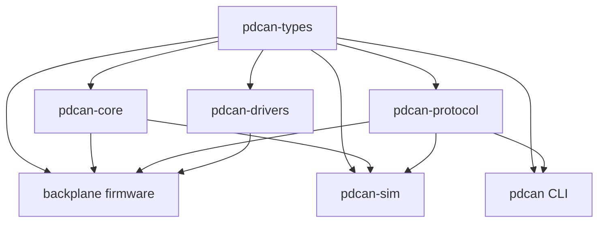

# Firmware Plan Review and Repository Integration Proposal

- Status: Draft for review
- Scope: Backplane Backpack firmware, shared PDCAN crates, host CLI, documentation, and repository integration
- Source plan: [`backplane-backpack/backplane-plan.md`](backplane-backpack/backplane-plan.md)
- Target hardware: [`hardware/boards/backplane-backpack`](../hardware/boards/backplane-backpack/)

> RPLY: Note! The current revA hardware is targeting the sw3538 PD controller. You can see the registers here: docs/data-sheets/iSmartWare/sw3538.registry.pdf

The Rev A driver and capability spike must use
[`docs/data-sheets/iSmartWare/sw3538.registry.pdf`](../docs/data-sheets/iSmartWare/sw3538.registry.pdf)
as the authoritative SW3538 register reference. The older misspelled/alternate
registry copy must not be treated as a separate device specification.

## 1. Executive summary

The source plan has a strong architectural center and should be used as the basis for implementation. In particular, it makes the correct high-level choices around:

- a deterministic, explicit-time event/action core;
- one exclusive owner for the physical I2C peripheral, TCA9548A, and downstream devices;
- separate logical states for module presence and USB-C partner/contract state;
- desired policy versus observed hardware state;
- semantic PD-controller operations instead of register-level commands;
- a shared, explicitly encoded CAN-FD protocol;
- UID-based manual commissioning and duplicate-address recovery;
- host-side unit and integration testing; and
- hardware-in-the-loop validation of hot-swap and recovery behavior.

The proposed repository tree should not be adopted verbatim, however.
It is written as if `pdcan/` were the root of a new repository, while this repository already has established top-level hardware, firmware, documentation, scripts, release, CI, and tool-management structures.

The recommended integration is therefore:

1. Make the existing repository root a virtual Cargo workspace.
2. Keep board-specific firmware under `firmware/backplane-backpack/`.
3. Put reusable `no_std` Rust crates under root-level `crates/`.
4. Put host applications under `tools/`.
5. Continue using the existing `docs/decisions/` directory rather than adding a parallel `docs/adr/` hierarchy.
6. Remove the obsolete WT32/controller architecture from active documentation and
   describe the STM32/CAN Backplane Backpack as the active design. Existing hardware
   source files are not deleted as part of this documentation cleanup.

> RPLY: At this point in time, the wt32 is obsolete and it can be removed/ignored entirely.
> Anything on "the other side of the CAN BUS"  other than the `pdcan` tool can be ignored.

Firmware for an ESP32 or any other peer on the other side of CAN is outside this
repository plan. PDCAN must support such a peer at the protocol boundary, but the
only host implementation planned here is the Linux `pdcan` tool.

The other major change is to distinguish firmware capacity from physical board population:

```text
PDCAN protocol and firmware capacity: 8 ports
Backplane Backpack Rev A:             6 populated ports
TCA9548A channels 6 and 7 on Rev A:   test pads only
```

> RPLY: good point. The current revA hardware that is under development only supports up to 6 ports but that should be a logical/soft-cap rather than a hard limit.

The protocol, shared types, core logic, and simulator should support eight ports. A board definition supplied by the firmware crate should advertise and activate only ports 0 through 5 on Rev A.

## 2. Resolved hardware-capacity model

### 2.1 Maximum capacity

The product-level maximum remains eight ports:

```rust
pub const MAX_PORTS: usize = 8;
```

The following should continue to support all eight:

- `PortId` and port bitmaps;
- CAN target allocation;
- core slot storage and scheduling;
- persistent configuration format;
- simulator behavior;
- protocol golden vectors; and
- host CLI parsing and presentation.

### 2.2 Rev A capabilities

Rev A has six physical downstream I2C connectors. TCA9548A channels 6 and 7 terminate at test pads rather than carrier/module connectors.

Board-specific firmware should provide a compile-time definition similar to:

> RPLY: This is a good idea! How does the firmware change so I can compile for a revA and a future revB with 8 ports?

```rust
pub struct BoardDefinition {
    pub hardware_revision: HardwareRevision,
    pub supported_ports: PortBitmap,
    pub mux_channel_by_port: [Option<u8>; MAX_PORTS],
    pub power_gate_bit_by_port: [Option<u8>; MAX_PORTS],
    pub default_fan_mode: FanMode,
}

pub const REV_A: BoardDefinition = BoardDefinition {
    hardware_revision: HardwareRevision::RevA,
    supported_ports: PortBitmap::from_bits(0b0011_1111),
    mux_channel_by_port: [
        Some(0),
        Some(1),
        Some(2),
        Some(3),
        Some(4),
        Some(5),
        None,
        None,
    ],
    power_gate_bit_by_port: [None; MAX_PORTS],
    default_fan_mode: FanMode::ThreeWire,
};
```

The exact Rust representation may differ, but the distinction must remain explicit.

Implement board selection with mutually exclusive Cargo features backed by separate
modules, for example:

```text
firmware/backplane-backpack/src/board/
├── mod.rs
├── rev_a.rs
└── rev_b.rs            # six-slot PCA9554/FET prototype
```

`board-rev-a` selects `REV_A`; `board-rev-b` selects `REV_B`; selecting
neither or both is a compile error. `cargo xtask firmware build --board rev-a`
translates the human-facing board name into the correct feature and target flags.
Each image embeds its hardware revision and supported-port bitmap so `pdcan info`
can report them and firmware can reject a mismatched board configuration.

CI builds and lints both defined board features. Rev B currently describes the
six-slot power-switch prototype: mux channels `0..5` and PCA9554 outputs `P0..P5`
map to logical ports `0..5`; `P6/P7` remain inputs and unsupported. The eight-port core and protocol
paths remain covered by host/simulator tests.

### 2.3 Required behavior

On Rev A:

- ports 0 through 5 are valid logical ports;
- ports 6 and 7 are unsupported, not absent;
- the scheduler must not probe mux channels 6 and 7;
- heartbeat online/connected/fault bitmaps use only supported bits;
- `BOARD_INFO` should include a supported-port bitmap or equivalent capability field;
- commands for ports 6 and 7 return `INVALID_TARGET` or `UNSUPPORTED`, not `NO_MODULE`; and
- the CLI should present the board as a six-port board.

On the Rev B prototype:

- ports `0..5` remain the supported logical ports;
- PCA9554 outputs `P0..P5` map directly to ports `0..5`;
- unused `P6/P7` remain configured as inputs and output-shadow bits `6..7` stay low;
- an unpowered port is not probed and its physical module presence is unknown;
- an enabled policy is persisted before its input FET may be turned on;
- ports are energized and initialized sequentially;
- a failed initial probe or failed policy application removes input power; and
- `EMERGENCY_DISABLE` sends an upstream PCA9554 all-off write before SW3538
  cleanup, subject to shared-I2C availability.

Core and simulator tests should still exercise eight supported ports so a future hardware revision can use all mux channels without redesigning the protocol.

### 2.4 Port numbering

The protocol and CLI both use zero-based port targets `0` through `7`.

> RPLY: always 0 based in both firmware and CLI. The users of this product will be engineers and developers, not end users. 0 based is the correct choice.

```text
wire protocol: 0-based ports 0..7
CLI/display:   0-based ports 0..7
```

CLI help, JSON fields, board silkscreen, protocol documentation, logs, and tests must
use that numbering consistently. No display-layer `+1` conversion is permitted.

## 3. Recommended repository layout

Use the existing repository root as the Cargo workspace root:

```text
modular-rack-power/
├── Cargo.toml
├── Cargo.lock
├── rust-toolchain.toml
├── .cargo/
│   └── config.toml
│
├── crates/
│   ├── pdcan-types/
│   ├── pdcan-core/
│   ├── pdcan-protocol/
│   └── pdcan-drivers/       # includes SW3538, mux, flash record, and PCA9554
│
├── firmware/
│   ├── README.md
│   ├── plan.md
│   └── backplane-backpack/
│       ├── Cargo.toml
│       ├── build.rs
│       ├── memory.x
│       ├── backplane-plan.md
│       └── src/
│           ├── main.rs
│           ├── board/
│           │   ├── mod.rs
│           │   ├── rev_a.rs
│           │   └── rev_b.rs
│           ├── channels.rs
│           ├── action_executor.rs
│           ├── can.rs
│           ├── config_store.rs
│           └── tasks/
│               ├── mod.rs
│               ├── controller.rs
│               ├── pd_bus.rs
│               ├── power.rs
│               ├── can.rs
│               ├── fan.rs
│               ├── status.rs
│               └── supervisor.rs
│
├── tools/
│   ├── pdcan/
│   └── pdcan-sim/
│
├── xtask/
│   ├── Cargo.toml
│   └── src/main.rs
│
├── docs/
│   ├── pdcan/
│   │   ├── protocol.md
│   │   ├── commissioning.md
│   │   ├── firmware-architecture.md
│   │   └── can/
│   │       └── pdcan.dbc
│   └── decisions/
│       ├── 0001-board-split.md
│       ├── 0002-controller-board-split.md
│       ├── 0003-backplane-backpack-architecture.md
│       └── ...
│
└── scripts/
    └── pdcan-vcan.sh
```

> RPLY: what is `xtask` here?

`xtask` is a small host-side Rust binary kept in the workspace for repository
automation that needs Cargo/project knowledge. It is invoked through commands such
as `cargo xtask test`, `cargo xtask firmware build --board rev-a`, `cargo xtask
flash`, `cargo xtask dbc`, and `cargo xtask vcan`. It does not run on the backpack;
it keeps build flags, board selection, size checks, DBC generation, flashing, and
integration-test orchestration in typed, testable code instead of duplicating shell
logic across CI and developer scripts.

> RPLY: the layout does look good / make sense to me; approved.

### 3.1 Why the workspace belongs at the repository root

The firmware, shared domain logic, shared protocol, simulator, and host CLI are one versioned system. A root workspace provides:

- one `Cargo.lock` for the executable products;
- one dependency/version policy;
- simple path dependencies;
- one CI entry point;
- straightforward cross-crate refactoring; and
- no duplicate `README`, `LICENSE`, `.gitignore`, or toolchain files inside a nested PDCAN pseudo-repository.

The root workspace does not interfere with the existing KiCad layout.

### 3.2 Cargo workspace behavior

The root `Cargo.toml` should be a virtual workspace using the current stable resolver. It should define `default-members` so ordinary host commands do not attempt to build the embedded binary for the host target.

Conceptually:

```toml
[workspace]
resolver = "3"
members = [
    "crates/*",
    "firmware/backplane-backpack",
    "tools/*",
    "xtask",
]
default-members = [
    "crates/*",
    "tools/*",
    "xtask",
]
```

The exact glob/member list should be validated against Cargo behavior when scaffolded.

### 3.3 Mixed host and embedded targets

Do not put a global embedded target under `[build]` in root `.cargo/config.toml`. Doing so would make host tests, `pdcan`, `pdcan-sim`, and `xtask` compile for `thumbv6m-none-eabi`.

Instead:

- add `thumbv6m-none-eabi` to `rust-toolchain.toml`;
- use target-specific runner and linker settings under `[target.thumbv6m-none-eabi]`;
- have `xtask` pass `--target thumbv6m-none-eabi` for firmware builds; and
- keep normal `cargo test` on the host target.

The root `.cargo/config.toml` should also define the alias required by the proposed command surface:

```toml
[alias]
xtask = "run --package xtask --"
```

Without the alias, `cargo xtask ...` is not a built-in Cargo command.

> RPLY: understood.

### 3.4 Linker memory description

Choose one source of truth for the firmware memory map:

- Embassy's generated `memory.x`; or
- a checked-in `memory.x` maintained by this repository.

Because persistent configuration needs a dedicated reserved flash region, a checked-in memory layout is preferable. The reserved pages and application flash boundary should be visible in code review and protected from accidental application linking.

Do not enable automatic memory-script generation at the same time as maintaining a custom `memory.x`.

> RPLY: I agree; a checked-in memory layout is preferable.

### 3.5 Existing tooling

The repository already uses `mise.toml` for project tools and tasks. Keep `cargo xtask` as the canonical implementation for Rust-aware operations, with optional thin `mise` tasks that delegate to it.

Avoid implementing the same build/flash/test logic independently in both `mise.toml` and `xtask`.

Suggested responsibility split:

```text
rust-toolchain.toml: Rust version, components, embedded target
mise.toml:           external project tools and thin task aliases
xtask:               Cargo-aware build, test, DBC, and firmware orchestration
scripts/:            small OS-level helpers such as vcan setup
```

> RPLY: Approved


### 3.6 Git ignore and generated output

Add root-level Rust build output to `.gitignore`:

```gitignore
/target/
```

Continue using the existing `build/` directory for non-Cargo generated artifacts when appropriate.

> RPLY: Approved

## 4. Crate boundaries

> RPLY: Everything below is approved.
> In general, please use mermaid diagrams in markdown documents rather than ascii-art diagrams.


### 4.1 Recommended dependency direction



More explicitly:

```text
pdcan-types       -> no internal PDCAN dependencies
pdcan-core        -> pdcan-types
pdcan-protocol    -> pdcan-types
pdcan-drivers     -> pdcan-types
firmware          -> types + core + protocol + drivers
pdcan CLI         -> types + protocol
pdcan-sim         -> types + core + protocol
```

Avoid a dependency from `pdcan-core` to `pdcan-protocol`.

### 4.2 `pdcan-types`

Keep this as a small `#![no_std]` vocabulary crate containing validated domain types:

- `NodeId`;
- `PortId`;
- `PortBitmap`;
- `NodeUid`;
- `TransactionId`;
- `PortPolicy`;
- `PortTelemetry`;
- `PortStatus`;
- `FaultFlags`;
- `FirmwareVersion`; and
- `HardwareRevision`.

Use constructors or newtypes to prevent invalid values where practical. For example, a commissioned `NodeId` should not be able to contain the broadcast or reserved values.

Do not turn this crate into a miscellaneous shared-code bucket.

### 4.3 `pdcan-core`

Keep the core pure, deterministic, `no_std`, and independent of:

- Embassy;
- `embedded-hal`;
- STM32 HAL/PAC types;
- SocketCAN;
- flash implementations;
- wall-clock APIs;
- filesystems; and
- logging implementations.

The source plan's event/action model is correct, but its sample `Action::Publish(OutboundMessage)` leaks transport/protocol concepts into the core.

Prefer semantic outputs such as:

```rust
pub enum Action {
    ProbeModule {
        operation: OperationId,
        port: PortId,
        slot_epoch: SlotEpoch,
    },
    ReadStatus {
        operation: OperationId,
        port: PortId,
        slot_epoch: SlotEpoch,
    },
    ApplyPolicy {
        operation: OperationId,
        port: PortId,
        slot_epoch: SlotEpoch,
        policy: PortPolicy,
    },
    ReportCommand(CommandOutcome),
    ReportState(PortStateChange),
    ReportTelemetry(PortTelemetry),
    PersistConfig {
        revision: ConfigRevision,
        settings: PersistentSettings,
    },
    SetLed(LedState),
    SetFan(FanCommand),
}
```

The firmware adapter maps semantic reports into `pdcan-protocol` frames.

> RPLY: Approved

### 4.4 Operation correlation and stale completions

Hardware actions are asynchronous relative to core state changes. Every completion that can arrive after the slot changes should carry:

- an `OperationId`; and
- a `SlotEpoch` or module-generation value.

The core increments the epoch when module identity/lifecycle is reset. A completion
with an old epoch is ignored for state mutation and always recorded diagnostically
with its operation ID, stale/current epoch, and port.

> RPLY: Record, diagnostically.

This prevents behavior such as:

```text
1. Read starts against module A.
2. Module A is removed.
3. Module B is inserted in the same slot.
4. The old read completion arrives.
5. Module A's state is incorrectly applied to module B.
```

Configuration persistence should similarly carry a revision so an older save completion cannot acknowledge a newer requested state.

> RPLY: Yes, I agree. Version everything where it makes sense!

### 4.5 Bounded action production and backpressure

The plan correctly requires statically bounded queues, but the core API must define how multiple actions are emitted and what happens when consumers are full.

Use a state-derived pull scheduler. The core records desired work and exposes a
`next_action()`/poll interface instead of attempting to push an unbounded burst of
actions into a channel:

```rust
controller.handle_event(event);

while executor.has_capacity() {
    let Some(action) = controller.next_action() else {
        break;
    };
    executor.dispatch(action);
}
```

Periodic reads are represented as due/coalesced state, not one queued item per
timer tick. Permit at most one ordinary PD operation in flight per port. Maintain
small, explicitly bounded urgent capacity for command responses, fault reports,
and emergency work; latest-value telemetry may be replaced by newer telemetry.
This makes backpressure visible to the scheduler and prevents a temporary full
consumer queue from silently losing required state transitions.

Required invariants include:

- no action is silently lost;
- emergency/all-port operations have enough capacity for the worst-case burst;
- telemetry may be coalesced rather than queued indefinitely;
- command responses and fault events cannot be displaced by telemetry; and
- queue exhaustion is observable and covered by tests.

> RPLY: I don't fully understand the tradeoffs here. Let's discuss this more. Additionally, are there simple tests that can be written/compiled/run to determine what the effective limits of the hardware are?

The principal tradeoff is a little more scheduler state and fairness logic in
exchange for smaller bounded memory and no need to reserve a queue slot for every
possible event burst. Validate the limits without hardware by:

- compile-time assertions and `size_of` reports for queue elements, core state, and
  protocol buffers;
- linker-map checks for flash/static RAM and CI failure above agreed headroom;
- simulator stress tests with all eight ports due, CAN backpressure, removal, and
  an emergency command at the same instant;
- assertions that every required action is eventually dispatched and queue
  high-water/overflow counters remain observable; and
- model/property tests for fairness, priority, coalescing, and stale completion
  handling.

HIL is still required for stack high-water marks, interrupt load, I2C/CAN latency,
flash stalls, and actual bus saturation. Initial watchdog and latency limits remain
provisional until that hardware exists.

### 4.6 `pdcan-protocol`

Keep explicit byte-level encoding and golden vectors. Avoid Rust ABI memory copies and generic serialization formats for the wire contract.

The protocol crate should own:

- 29-bit ID construction and parsing;
- CAN-FD payload encoding and decoding;
- DLC validation;
- enum and reserved-bit validation;
- compatibility/version rules; and
- conversion between wire messages and shared semantic types.

It should not own SocketCAN I/O or firmware scheduling.

> RPLY: Approved. Also, I only intend to support Linux with adapters that show up as regular network interfaces.
> For example, the USB/CAN adapter that I have been using shows up as `can0` and can be used with the standard Linux `ip` and `can-utils` tools.
> Does this make it easier or harder to implement the protocol crate? This decision is not currently set in stone so is socketcan is easier than `can0`, let's talk about that!

`can0` is a Linux SocketCAN network interface, so these are complementary rather
than competing choices. `pdcan-protocol` remains pure byte/identifier encoding and
has no OS dependency. The Linux-only `pdcan` binary uses a SocketCAN crate to bind
to `can0` for hardware or `vcan0` for tests. This is the simplest host boundary and
allows standard `ip` and `can-utils` tools to inspect the same bus independently.

### 4.7 `pdcan-drivers`

Limit this crate to hardware mechanisms that gain real value from generic `embedded-hal`/`embedded-hal-async` testing:

- TCA9548A selection/reset-independent protocol;
- PCA9554 output-latch-first initialization, masked shadow updates, and all-off
  sequencing;
- the selected PD-controller register driver;
- PD raw-value scaling and semantic conversions; and
- possibly the persistent-record format and CRC logic.

Keep these board-specific mechanisms in the firmware crate unless a second consumer justifies extraction:

- STM32 flash-page operations;
- timer/DMA selection for the status LED;
- physical fan pin/timer setup;
- TCAN3413 standby GPIO handling; and
- the Rev A board definition.

For persistent storage, separate the host-testable record codec from the STM32 flash adapter.

> RPLY: Approved.

## 5. Firmware concurrency and ownership

### 5.1 Task model

The proposed small set of long-lived Embassy tasks is appropriate:

| Task | Exclusive responsibility |
|---|---|
| `controller_task` | Own core state; accept events; dispatch actions |
| `pd_bus_task` | Own I2C2, upstream PCA9554/TCA9548A transactions, and all PD operations; only legacy Rev A owns PA3 mux reset |
| `can_task` or CAN RX/TX halves | Own FDCAN and protocol adaptation |
| `fan_task` | Own fan PWM/tach mechanism |
| `status_task` | Own LED rendering/timing mechanism |
| `supervisor_task` | Aggregate liveness and control watchdog feeding |

One task per PD module should not be used.
The physical bus is serialized and per-port tasks would add mux races and cancellation complexity without adding hardware concurrency.

> RPLY: Approved.

### 5.2 Channel semantics

Do not use one undifferentiated FIFO for every action.

Suggested semantics:

```text
must-deliver bounded Channel:
    PD control operations
    command responses
    critical fault events
    configuration persistence

priority/bounded CAN scheduler:
    urgent control responses and faults
    state changes
    heartbeat
    coalesced telemetry

Signal/Watch/latest-value mechanism:
    desired LED state
    desired fan state
    latest periodic telemetry awaiting transmission
```

A controller task must not await forever while sending a replaceable LED or telemetry update into a full queue.
> RPLY: Approved.

### 5.3 CAN task shape

One logical owner of FDCAN is correct. Whether this is one Embassy task using `select`, or separate RX/TX tasks using HAL-supported split halves, should follow the actual Embassy API and cancellation behavior.

The architectural invariant is exclusive, race-free ownership rather than a mandatory number of task functions.

### 5.4 Watchdog progress

The supervisor should feed the watchdog only when required subsystems have made progress within defined windows.

Progress should be based on monotonically advancing counters or timestamps, not simple boolean "alive" flags that can remain set forever.

Define:

- which subsystems are mandatory;
> RPLY: The primary goal of this device is to report the USB/C status upstream. This is not just for telemetry but for safety (over current/temp/short circuit) and for the ability to disable power to a downstream device. Therefore, the CAN bus and the PD controller must be considered mandatory subsystems.
- maximum acceptable no-progress interval for each;
- degraded behavior when CAN is bus-off but local PD management remains healthy;
- whether an absent set of all modules is healthy;
> RPLY: Yes, the health of the backpack is independent of the health of the modules. The backpack should be able to report its own health even if all modules are absent or dead.
- flash-operation allowances; and
- what state is captured before an intentional watchdog reset.

> RPLY: Let's discuss each of the above line-items that I did not reply to. I don't understand what `maximum acceptable no-progress interval for each` means, same with flash-operation allowances, and what state is captured before an intentional watchdog reset. I think I understand the rest of the items.

For this firmware, a mandatory subsystem is a task/mechanism whose loss prevents the
backpack from performing its purpose. The controller, PD-bus owner, CAN owner, and
supervisor are mandatory. The presence or health of any individual downstream
module is not: zero installed modules, or six failed modules, can still be a healthy
backpack if it can diagnose and report that state.

"Maximum acceptable no-progress interval" means the longest time a mandatory
subsystem may go without completing useful work or completing a bounded recovery
attempt. Examples include the CAN owner servicing RX/TX or bus-off recovery and the
PD-bus owner completing a transaction, timing it out, or advancing recovery. The
supervisor compares monotonically advancing counters/timestamps against those
deadlines. Exact intervals are not knowable before hardware characterization, so
the implementation should make them named constants, start with conservative
provisional values, expose near-miss/reset diagnostics, and establish final values
through HIL rather than treating the draft numbers as requirements.

"Flash-operation allowance" means a known, bounded erase/program operation is
allowed to stall normal progress for its measured worst-case duration plus margin.
It is not an unlimited watchdog exemption. Flash code reports operation start/end,
the supervisor applies only the bounded allowance, and a hung flash operation still
causes reset.

Before an intentional watchdog reset, capture a compact diagnostic record where
the MCU permits it: reset intent/reason, uptime, failing subsystem, last PD port/mux
channel/operation ID, I2C recovery stage, CAN state, and queue high-water/overflow
counters. Prefer backup/no-init RAM for this transient record and publish it after
reboot; do not erase flash on every watchdog event merely for logging. Normal reset-
cause registers must also be reported. The exact storage mechanism should be
validated during bring-up.

CAN bus-off or host absence does not change the last desired per-port policy. Local
PD monitoring and enforcement continue, the node records degraded/offline state,
and CAN recovery is retried. Loss of CAN alone does not automatically disable
ports. Emergency-disable persistence remains independent and continues to dominate
all per-port policy.

## 6. I2C, mux, and hot-swap behavior

### 6.1 TCA reset is board-specific

Legacy Rev A connects `I2C_MUX_RESET_N` to STM32 PA3. The stable Rev B
backplane does not export reset: its six-pin backpack boundary contains only two
grounds, two 3.3 V pins, upstream SDA, and upstream SCL. Rev B leaves PA3 unused
and treats the mux's local pull-up/power-on reset as a hardware-only mechanism.

### 6.2 Recovery ordering

Recovery begins by issuing an I2C command to deselect mux channels. That command
may be impossible if a selected downstream device holds SDA low.

The recovery design should account for this explicitly:

```text
transaction error/timeout
    -> abort or reinitialize the STM32 I2C transaction safely
    -> attempt deselect if the bus is still operational
    -> on legacy Rev A only, assert TCA9548A RESET_N if needed
    -> on Rev B, report failure and retry; no mux reset crosses the boundary
    -> restore upstream I2C peripheral/pins
    -> perform GPIO/SCL recovery if the upstream side still requires it
    -> resume bounded probing
```

Exact ordering should be verified on hardware.

### 6.3 Timeout cancellation safety

`embedded-hal-async::I2c` operations do not themselves define the entire timeout/recovery policy. Wrapping an operation in an async timeout can drop the I2C future mid-transaction.

The implementation must verify whether the selected Embassy STM32 I2C operation is cancellation-safe. If not, timeout handling must explicitly abort/reinitialize the peripheral before another transaction is attempted.

Driver fake tests alone cannot prove peripheral cancellation behavior; this also needs a firmware/HIL test.

### 6.4 Quantitative timing budgets

"Finite timeout" is necessary but not sufficient. Phase 0/bring-up should establish numeric targets for:

- maximum single I2C transaction duration;
- maximum stuck-slot service delay;
- maximum control-command dispatch latency;
- absence/recovery thresholds;
- maximum time before healthy ports resume after bus/mux recovery; and
- maximum boot-to-discovery time.

These numbers should then appear in tests and the definition of done.

### 6.5 Known Rev A power-policy initialization limitation

Rev A has no MCU-controlled high-side switch between the backplane supply and each
SW3538/module. The firmware can program a module's advertised PDOs and enforce the
configured per-port ceiling only after the MCU has booted, discovered the module,
established I2C communication, and applied the stored policy.

Consequently, Rev A firmware cannot guarantee the configured `20 V`, `5 A`, and
`100 W` ceilings during that initialization window. A newly powered or newly
inserted module can temporarily retain or advertise its hardware/default
configuration before firmware policy has been applied. This is a documented Rev A
limitation, not a safety-rated hardware cutoff.

The expected Rev A provisioning workflow is:

1. Provision the backpack.
2. Populate the PD modules.
3. Configure and persist each port's policy with `pdcan`.
4. Attach downstream loads only after configuration has completed successfully.

Firmware should still apply stored policy as early as practical and report whether
each supported port is uninitialized, being configured, compliant, or failed. HIL
bring-up should measure the boot/insertion-to-policy-applied interval and record the
SW3538 power-on behavior, but eliminating the interval is not a v1 firmware
requirement.

The Rev B prototype adds one backplane-side high-side FET per slot, driven by a
PCA9554 I2C GPIO expander at address `0x20`. The TCA9548A mux has moved onto the
main backplane and remains at `0x70`; both devices share the upstream I2C bus, but
the expander is upstream of the mux and never requires channel selection. Each
FET disconnects the complete module input, including the SW3538.

This provides deterministic cold-boot-off through the PCA9554 power-on input
state and external gate pull-downs. It provides shutdown independent of SW3538
responsiveness, but **not** independent of upstream I2C health. The PCA9554 has no
asynchronous output-enable or reset pin. A stuck bus can prevent a cutoff write,
and an MCU-only watchdog reset can leave previously enabled outputs active until
startup firmware successfully writes all-off. Complete power loss returns the
expander pins to inputs and the pull-downs turn every slot off. A future hardware
revision needs a separate disable/reset signal if shutdown during a bus fault or
MCU reset must be guaranteed.

The FET still does **not** let firmware configure the controller while its source
path remains isolated. After a FET is enabled, the SW3538 must boot before I2C
configuration can begin, so its hardware/default behavior exists during that
shorter initialization interval. Eliminating that interval would require a
separate controller supply/source inhibit or verified-safe reset defaults.

Rev B uses this state sequence:

```text
PoweredOff -> SwitchingOn -> PowerSettling -> Probing -> ApplyingPolicy -> Ready
```

The implementation uses a provisional `10 ms` rail-settling delay which must be
measured and replaced during HIL bring-up. A newly enabled policy is durably
persisted before `SwitchingOn`. The I2C task does not probe a gated-off port; it
cannot distinguish an installed module from an empty connector until the port is
intentionally energized. The first failed probe, a later removal/NACK, or a failed
policy application schedules physical power-off rather than leaving an
unconfigured controller energized.

The prototype control contract is:

| Device/register | Value | Function |
|---|---|---|
| PCA9554 address | `0x20` | A2:A0 are all low |
| Output register | initialize to `0x00` | all slot enables off before direction changes |
| Configuration register | `0xC0` | `P0..P5` outputs; unused `P6/P7` inputs |
| TCA9548A address | `0x70` | six SW3538 channel paths on the main backplane |

The stable physical boundary is:

| Backplane `J2` pins | Signals | Ownership |
|---|---|---|
| `1`, `3` | `GND` | shared logic return |
| `2`, `4` | `+3V3` | supplied by backpack to backplane logic |
| `5`, `6` | `I2C_UP_SDA`, `I2C_UP_SCL` | STM32 upstream bus |

The backpack owns the I2C peripheral and scheduling. The backplane owns the one
TCA9548A, one PCA9554, every mux channel, FET gate, slot pull-up/protection
circuit, and carrier connector. No per-slot signal, mux reset, expander interrupt,
or power-control GPIO crosses the boundary.

The PCA9554 power-on default is all inputs with an output-latch default of high.
External gate pull-downs keep the FETs off while the pins are inputs. Firmware
must write the output register to zero **before** writing configuration `0xC0`;
reversing that order can pulse every slot on. Output bit `0` maps to port `0`
through bit `5` to port `5`. The five former shift-register GPIOs remain unused.

### 6.6 V1 SW3538 policy ceiling

Firmware must never intentionally configure or advertise a policy above any of
these limits:

```text
maximum output voltage: 20 V
maximum output current: 5 A
maximum output power:   100 W
```

Validate all three constraints before accepting/persisting a policy and again before
encoding the corresponding SW3538 register sequence. Out-of-range requests return a
specific validation error and leave the previous policy unchanged. EPR is
unsupported in v1, and the SW3538's proprietary/nonstandard 7 A behavior must not
be exposed or enabled. If observed telemetry exceeds configured tolerances,
firmware records a fault and makes a best-effort high-priority disable attempt.

This is a firmware-enforced soft ceiling, not an independent overcurrent protection
device. It is subject to the initialization limitation in Section 6.5 and to the
Rev A I2C/SW3538 emergency-control limitations in Section 8.6.

## 7. STM32 and board resource planning

### 7.1 Device viability

The STM32C092FCP6 premise is viable:

- STM32C092 provides application FDCAN;
- PA11/PA12 are assigned to FDCAN RX/TX in the current Rev A handoff;
- the TSSOP20 limitation applies to the system-memory CAN bootloader, not application FDCAN;
- current Embassy documentation provides a chip-specific `stm32c092fc` build with CAN, I2C, flash, UID, timer, and watchdog modules; and
- STM32C092 provides 256 KiB flash and 30 KiB SRAM.

References:

- [ST STM32C092FC product page](https://www.st.com/en/microcontrollers-microprocessors/stm32c092fc.html)
- [ST STM32C091/C092 datasheet](https://www.st.com/resource/en/datasheet/stm32c092cc.pdf)
- [Embassy STM32C092FC documentation](https://docs.embassy.dev/embassy-stm32/git/stm32c092fc/index.html)

### 7.2 RAM and flash budgets

Thirty KiB of SRAM is sufficient for this design only if queue and buffer sizes are deliberate.

Track in CI or release checks:
> RPLY: This is a very good idea, please make sure it is planned/implemented!

- release binary flash usage;
- static RAM usage;
- FDCAN message RAM allocation;
- Embassy task-future/static allocation;
- channel capacities and element sizes;
- logging buffers; and
- worst-case stack usage where applicable.

The plan should include explicit headroom thresholds rather than allowing the firmware to grow to the device limit unnoticed.

> RPLY: agree. At this time, I am also considering OTA firmware updates so flash usage should be tracked and monitored closely.
> Sacrificing features or robustness or logging telemetry to save flash space is not acceptable. If there's not enough room for OTA then there isn't enough room and I'll have to consider a different MCU with more flash in a future revision.

CAN-based firmware update is explicitly out of scope for v1. Do not allocate a v1
bootloader, dual-image slots, or an update transport at the expense of application
features, robustness, or useful diagnostics. The checked-in `memory.x` therefore
reserves only the application and power-fail-safe configuration regions required by
v1. Continue reporting flash headroom so a future update design can be evaluated;
if a robust updater does not fit later, select a larger MCU rather than weakening
the application.

### 7.3 Timer allocation

The current hardware handoff assigns:

| Function | Pin | Candidate peripheral |
|---|---|---|
| Fan PWM/control | PA0 | TIM2_CH1 |
| Fan tach capture | PA1 | TIM17_CH1 |
| Status LED data | PA2 | TIM15_CH1 or GPIO |
| I2C | PA6/PA7 | I2C2 |
| CAN | PA11/PA12 | FDCAN1 |

Reserve TIM3 exclusively for Embassy timekeeping. It is present on STM32C092,
requires no external pin for this use, and avoids TIM2, TIM15, and TIM17, which are
assigned to fan/LED functions. Select Embassy's explicit TIM3 time-driver feature
rather than an automatic timer choice, and add a compile-time/build check so a
future peripheral assignment cannot silently reuse it.

> RPLY: Pick an appropriate timer for Embassy timekeeping.

The LED implementation should avoid long interrupt-disabled bit-banging that could disrupt CAN or I2C timing.
> RPLY: Agree

Prefer verified timer/DMA or another hardware-assisted encoding method if the pin/peripheral mapping supports it.

### 7.4 CAN clocking

Rev A currently assumes the internal HSI clock. Before CAN-FD bitrates are frozen, validate:

- oscillator accuracy across voltage and temperature;
- nominal and data-phase bit timing;
- sample points;
- BRS choice;
- transceiver delay;
- intended cable length/topology; and
- behavior against the actual host adapter and multiple boards.

> RPLY: For now, let's assume standard 1Mbit/s CAN-FD.
> I am adding chokes/ESD and other protection to the CAN bus to make it more robust and I do anticipate that the total length of the CAN bus will be at most a few meters so I'm not that worried about a weak signal issue.

The v1 working configuration is:

```text
nominal/arbitration bitrate: 1 Mbit/s
data-phase bitrate:          2 Mbit/s
bit-rate switching (BRS):   enabled
maximum intended bus:        a few metres
```

Treat those as explicit PDCAN network parameters, not adapter defaults. Phase 1/HIL
must derive exact timing segments/sample points from the chosen clock, validate HSI
accuracy over the relevant conditions, and test the actual adapters and multiple
nodes. If HSI cannot meet the required margin, that is a hardware/clocking issue to
resolve rather than silently changing the network bitrate.

### 7.5 Fan configuration

The PCB supports materially different modes:

```text
3-wire fan: low-frequency switched-supply PWM, initially around 30 Hz
4-wire fan: approximately 25 kHz open-drain control PWM
```

The common semantic API is appropriate. Fan electrical mode is an explicit persisted
runtime configuration selected through `pdcan`, not inferred from tach behavior and
not encoded as a separate firmware image. A missing/invalid configuration defaults
to 3-wire mode.

> RPLY: I agree. I think the firmware should default to 3-wire fan mode and allow the user to configure it to 4-wire fan mode if they have a 4-wire fan. The user should be able to configure this via the CLI and the configuration should be persisted in flash so that it is remembered across power cycles.

Also define reset/fault behavior. In particular, confirm whether the desired safe default is fan off, fan full speed, or mode-dependent.

> RPLY: Default to full speed on power up and allow the user to configure the fan speed via the CLI.

On every reset, drive the fan at the mode-appropriate full-speed state first. After
the persisted record has been validated, apply the configured mode and requested
duty. Thermal faults, invalid tach behavior where meaningful, configuration errors,
or loss of the controlling task override the requested duty to full speed. Persist
both mode and requested duty; do not persist temporary safety overrides.

## 8. CAN-FD protocol review

### 8.1 Operational ID layout

The proposed 29-bit layout is a reasonable baseline:

```text
priority | class | node | target | message type
```

Keep the following properties:

- lower numerical priority wins CAN arbitration;
- semantic commands rather than raw register access;
- explicit little-endian fields and units;
- bounded fixed layouts;
- measured values separate from negotiated contract values;
- state-change events plus periodic snapshots; and
- exact golden vectors as the compatibility contract.

### 8.2 Discovery collision behavior

The plan correctly avoids using one common discovery response ID with different payloads. A UID/nonce-derived arbitration token reduces collisions but does not eliminate them.

> RPLY: I agree. At this time, I am only expecting a small number of 'backpack' nodes to be on the CAN bus at any given time. Well under 16 boards, most applications will probably be under 6 boards, closer to 2-4 boards.

If two nodes derive the same truncated token, they transmit the same arbitration ID with different payload data. CAN does not deliver both frames; the nodes generate an error and retry.

The commissioning specification must therefore define:

- token width and bit allocation;
- deterministic or randomized response delay/backoff;
- host timeout behavior;
- nonce rotation and retry count;
- how partial discovery results are merged; and
- how persistent token collisions are diagnosed.

Multiple discovery rounds are useful, but the retry behavior must be part of the protocol rather than only a CLI implementation detail.

Implementation note: the executable draft does not use a directly truncated
`CRC32(UID || nonce)`. CRC linearity makes a pairwise collision persist when the
same nonce is appended to both UIDs. The implemented token hashes the UID, folds
the nonce into both halves, applies a nonlinear avalanche finalizer, and takes the
low 12 bits. A property test constructs a real round-1 collision and verifies that
the next nonce separates it. `NODE_CLAIM` applies the same mixer with a
domain-separated Node ID and claim-round nonce.

### 8.3 Duplicate node claims

`NODE_CLAIM` has the same collision concern. Two boards with one commissioned Node ID must not transmit an identical claim arbitration ID with different UID payloads indefinitely.

Claims should use UID-derived arbitration or a specified response-slot/backoff mechanism while still including the claimed Node ID and full UID authoritatively.

Normal Node-ID traffic must remain suppressed until the claim window completes without conflict.

> RPLY: In this case, I would expect that a detected collision results in both backpack nodes reverting to uncommissioned state but I am open to other ideas here.

Keep the source plan's explicit `AddressConflict` state and do not erase either
node's persisted Node ID automatically. Both conflicting nodes suppress normal
Node-ID traffic, continue only the UID-addressed commissioning/conflict exchange,
and identify themselves by full UID. The operator resolves the conflict with
`pdcan` by assigning or clearing one or both identities. This preserves diagnostic
evidence and prevents a transient fault or hostile frame from erasing persistent
commissioning on multiple boards.

### 8.4 Transaction identity and deduplication

A 16-bit transaction ID is sufficient for short-lived request/response correlation but insufficient as a permanent duplicate key.

Define at least one of:

- a requester/session identifier;
- a per-host boot nonce;
- a bounded duplicate-cache lifetime; or
- a rule combining transaction ID with command identity/digest.

Otherwise a restarted CLI or wrapped transaction counter can cause a valid new command to be mistaken for an old duplicate.

The protocol supports more than one command host on the bus even though concurrent
use is expected to be uncommon. Add a small `RequesterId` to command/response
arbitration IDs and a 64-bit `RequestId` to command payloads. Every response echoes
both identities. Deduplication keys include requester, request ID, opcode/target,
and a bounded retention lifetime; `RequesterId` alone is neither a security
identity nor a sufficient duplicate key.

> RPLY: I don't anticipate multiple hosts on the CAN bus being _common_. I will almost certainly have an ESP32 speaking to the backpacks over CAN and I will ALSO have a host computer that can speak to the backpacks over CAN as part of development/test workflows.
> Given this, what do you think is the best way to do this?

Reserve requester `0` for protocol use, assign stable configured IDs to embedded
controllers, and reserve one documented development/default ID for `pdcan` (subject
to final bit allocation). `pdcan` accepts `--requester-id`; simultaneously active
hosts must not intentionally use the same ID. The exact split of the current
message-type bits into requester and opcode is finalized with the protocol table.

Normal arbitration is last accepted writer wins for persistent policy commands.
The emergency latch dominates every writer until explicitly acknowledged as
resolved. Responses are routed/correlated to their requester, but monitoring is not:
`pdcan monitor` and its JSON form must show all request and response traffic,
including requests issued by every other `RequesterId`, with optional requester
filters for debugging.

### 8.5 Version negotiation

Protocol version fields in heartbeat are useful but do not fully specify compatibility.

Define:

- protocol major/minor meaning;
- behavior on unsupported major versions;
- whether minor versions are backward compatible;
- how discovery exposes supported versions;
- unknown message-type behavior;
- unknown flag/reserved-field behavior; and
- how the CLI reports an incompatible node.

> RPLY: At this time, no backwards compatibility. The `pdcan` should be able to report the firmware version and the protocol version of each backpack node and the CLI should be able to report if a node is incompatible with the current version of the `pdcan` tool.
> It is expected that all nodes will be running the same version of firmware and protocol at any given time. If a node is incompatible, the CLI should report that and the user should be able to update the firmware on that node to make it compatible.

Operational v1 compatibility is exact-version only. Discovery remains minimal and
version-tolerant enough for `pdcan` to report UID, hardware revision, firmware
version, protocol version, and compatibility even when it cannot decode operational
messages. Unknown or incompatible operational frames are ignored and counted; the
CLI gives a clear mismatch diagnostic instead of attempting best-effort control.

CAN-based firmware update is not implemented in v1. An incompatible v1 node is
updated through SWD/service tooling. Preserve a small, stable management/update
identifier namespace and discovery envelope for a possible future bootloader so it
can be reached independently of the exact-match operational protocol; document
that separation now, but do not reserve image slots or implement update commands
until an updater is actually in scope.

### 8.6 Emergency disable semantics

The proposed broadcast `EMERGENCY_DISABLE` is executed through the same I2C path used for ordinary PD control. It cannot guarantee immediate or safety-rated removal of power if the I2C bus or PD module is wedged.

> RPLY: Yes. A future hardware revision will likely include a high-side FET to cut power to each module independently.
> At this time, the 'emergency disable' command is a best-effort command that will attempt to disable all ports as quickly as possible but it cannot guarantee that all ports will be disabled immediately or at all if the I2C bus or PD module is wedged.

For Rev A, the protocol and documentation must describe this as a best-effort,
highest-priority all-port disable. It is not a safety-rated emergency stop and no
guaranteed shutdown latency should be claimed before it is measured on hardware.

For Rev B, `EMERGENCY_DISABLE` first routes to the dedicated high-priority power
channel consumed by the single I2C owner. The task writes the PCA9554 all-zero
output register before attempting SW3538 cleanup. An emergency received during
the provisional power-settling delay preempts that delay. It cannot preempt an
I2C transaction already in progress, and a wedged upstream bus can prevent the
cutoff write; no safety rating or numeric latency is claimed.

> RPLY: At this time, it is latched and must be cleared by the host. Once cleared, ports may be re-enabled individually.
> This is different from the typical "power down/up" command that can be sent to an individual port.

The emergency condition is a backpack-wide persistent safety latch, distinct from
ordinary per-port desired policy and from a per-port power-cycle command. Required
behavior is:

- accepting `EMERGENCY_DISABLE` sets the in-memory latch immediately and schedules
  disable operations ahead of ordinary PD work;
- setting the latch is idempotent, so any host can safely retry the command;
- the latched state is committed to nonvolatile storage and survives watchdog
  reset, software reset, and complete power loss;
- a success response to the initiating request is not sent until the latched state
  has been durably committed; until that response, a host must treat persistence as
  unconfirmed and may retry;
- boot reads the latch before applying any stored port-enable policy;
- while latched, Rev A repeatedly attempts to make present ports safe through
  I2C; Rev B repeatedly requests a zero PCA9554 output register and does not
  intentionally enable any port; both continue
  health/status reporting and reject commands that would enable or renegotiate
  power;
- ordinary fault clearing and per-port power cycling never clear the backpack-wide
  latch; and
- clearing requires a dedicated, explicit operator-acknowledgment command from
  `pdcan`. The command means "the danger has been resolved; normal operation is
  safe now," not merely "retry the failed operation."

The CLI should make the destructive nature of that transition conspicuous. A
command shape such as the following is intentionally more explicit than a generic
`clear` command:

```text
pdcan emergency acknowledge-resolved <node>
```

The exact spelling can be finalized with the rest of the CLI, but scripts must be
able to invoke the same semantic command without an interactive prompt. Firmware
must durably commit the cleared latch before acknowledging success and before it
allows any port to re-enable. Clearing the latch does not itself enable a port;
afterward, ports may be enabled individually according to their persisted policy
and explicit operator commands.

There is necessarily a small interval between receipt of an emergency frame and
completion of its nonvolatile write. Rev A cannot guarantee survival of power loss
inside that interval. The protocol-level durability guarantee begins when the
firmware returns a successful response. This limitation, like the best-effort I2C
shutdown path, must be stated in the operator documentation.

### 8.7 Trust boundary

Commissioning and control are unauthenticated. State explicitly that the physical CAN bus is trusted and that access control, if required, belongs at a gateway boundary.

This becomes especially important if a future Ethernet/network controller exposes PDCAN commands remotely.

> RPLY: Yes, at this time there is no authentication or encryption on the CAN bus. The CAN bus is assumed to be a trusted network.

### 8.8 CLI and JSON contract

Before declaring CLI JSON stable, define:

- schema/version field;
- UID spelling and byte/hex order;
- port-number representation;
- units and whether values are integers;
- representation of unsupported versus absent ports;
- exit status conventions; and
- timeout/partial-result representation.

Use `uid` consistently unless the value is deliberately converted into a standards-compliant UUID. The STM32 factory value is a 96-bit unique device identifier, not inherently a UUID.

## 9. Persistent configuration

### 9.1 Required v1 persistence

Persist the following in v1:

- commissioned Node ID;
- fan electrical mode and requested duty/speed;
- desired policy for all eight logical port slots, including the two unsupported
  slots on Rev A so the format does not change for an eight-port board; and
- the backpack-wide emergency-disable latch.

Port policy writes are intentionally persistent. Expected use is only a few dozen
policy changes over the product lifetime, but the implementation must still avoid
erasing flash for unchanged values and must coalesce superseded pending saves.
Transient observations, negotiated state, telemetry, and ordinary per-port
power-cycle operations are not persisted.

Emergency-latch persistence is higher priority than ordinary configuration saves.
A stale normal-configuration completion must never overwrite a newer latched
state; revisioned requests/completions and serialized flash ownership must enforce
that invariant.

### 9.2 Record format

Each committed record should include:

- magic;
- format version;
- payload length;
- monotonically increasing sequence/revision;
- payload;
- integrity check; and
- a commit marker or other mechanism that distinguishes complete and interrupted writes.

### 9.3 Power-fail safety and wear

"Tolerate interrupted writes" needs a specific mechanism. Use a two-slot, append/journal, or equivalent design that preserves the previous valid record until the new record is committed.

Define:

- flash page/erase granularity;
- reserved region;
- maximum expected write frequency;
- record-selection rule at boot;
- behavior when all records are invalid;
- erase/program interaction with code execution and interrupts; and
- watchdog behavior during flash operations.

The record codec should be host-tested independently from the STM32 flash adapter.

The emergency latch may share the power-fail-safe record journal if its priority and
durability rules above can be met. If erase/program latency makes that unsafe or
unacceptably slow, give the latch a small dedicated one-way-programmable/journaled
record and treat clearing as a separate, less time-critical erase/commit operation.
The choice should follow measured STM32 flash behavior during bring-up.

## 10. Testing and validation

### 10.1 Keep the source plan's testing layers

Retain:

- deterministic `pdcan-core` unit tests;
- protocol golden vectors;
- fake-I2C driver tests;
- `vcan` CLI integration tests;
- a simulated peer/node;
- embedded release builds in CI; and
- HIL testing for hot removal, bus faults, duplicate nodes, fan modes, and persistence.

### 10.2 Add core invariants

In addition to scenario tests, assert invariants such as:

- an unsupported port is never probed;
- a module is never reported ready before desired policy is verified;
- an old `SlotEpoch` completion cannot change current slot state;
- no telemetry action outranks a queued disable action;
- one slot failure cannot prevent eventual service to another supported slot;
- an invalid flash record always produces uncommissioned state;
- no normal Node-ID traffic is emitted during an address conflict; and
- action/queue capacity is sufficient for worst-case transitions.

Property-based and decoder-fuzz testing would be valuable for the protocol codec and state-machine input validation.

### 10.3 Six-port versus eight-port coverage

Use separate configurations:

```text
core/simulator maximum configuration: supported mask 0xFF
Rev A firmware configuration:         supported mask 0x3F
```

Both must run in CI.

Physical HIL for Rev A should test six populated ports and partial population. The eight-port behavior remains a simulator/core requirement until hardware exposes all eight channels.

### 10.4 CI organization

Add a dedicated firmware/Rust workflow rather than mixing it into the existing KiBot render workflow.
Run it for every pushed commit and pull request that can affect firmware, shared
crates, protocol definitions, host tools, generated protocol artifacts, or the
workflow itself. Host/firmware/protocol end-to-end tests are required checks, not a
release-only activity.

Suggested jobs:

```text
host:
    fmt check
    clippy for host crates
    host unit tests
    protocol golden vectors
    CLI/simulator tests

firmware:
    release build for thumbv6m-none-eabi
    size report/budget check

docs/protocol:
    DBC generation or validation
    generated-file drift check
```

HIL should be a separately triggered or self-hosted workflow and should not be required on ordinary GitHub-hosted runners.

Linux `vcan` validates host behavior but does not validate real CAN arbitration, oscillator tolerances, error frames, bus-off, transceiver behavior, or CAN-FD timing. Those remain HIL responsibilities.

> RPLY: approved, please make sure that there are robust CI tests for the host/firmware/protocol integration and that the tests are run on every commit to the repository.

### 10.5 DBC ownership

Do not hand-maintain the DBC. Protocol allocation definitions are the source of
truth, and `cargo xtask dbc` deterministically generates the checked-in DBC and any
derived reference tables. CI regenerates them and fails on drift. Golden vectors
still validate the encoder/decoder behavior against those definitions.

> RPLY: Derive the DBC from the protocol allocation definitions. I would like to avoid having to maintain a DBC file manually.


## 11. Documentation integration and migration

### 11.1 Existing stale architecture documents

The following documents still describe the earlier WT32/controller architecture:

- [`firmware/README.md`](README.md)
- [`readme.md`](../readme.md)
- [`docs/system-overview.md`](../docs/system-overview.md)
- [`docs/interfaces.md`](../docs/interfaces.md)
- [`docs/decisions/0002-controller-board-split.md`](../docs/decisions/0002-controller-board-split.md)
- [`hardware/boards/README.md`](../hardware/boards/README.md)

The WT32/controller architecture is obsolete and is superseded by the Backplane
Backpack architecture. Remove it from current overview/interface documentation;
do not retain it as an active alternative and do not plan its firmware. This cleanup
is documentation-only: existing tracked hardware/design files are not physically
deleted by this firmware plan.

Descriptions of a future ESP32 or any other CAN peer are outside scope except where
needed to define the PDCAN multi-requester wire behavior. The Linux `pdcan` tool is
the only other-side implementation in this repository plan.

### 11.2 Decision history

Do not silently rewrite the rationale of the old controller split. Add a new
decision, likely `0003`, that describes the STM32/CAN Backplane Backpack and marks
decision 0002 as superseded. The current overview documentation should describe
only the active Backpack architecture while the decision log preserves why the old
direction changed.

### 11.3 ADR directory and numbering

Continue using `docs/decisions/`; do not create a competing `docs/adr/` directory.

The source plan contains 22 proposed ADRs starting again at 0001, which conflicts with existing repository numbering. Renumber new decisions after the existing entries.

Not every inline ADR needs a separate file. Consolidate them into approximately six to eight enduring decisions, for example:

1. Root Cargo workspace and pure-core boundaries.
2. Stable logical slots, desired state, and single-owner I2C architecture.
3. Custom CAN-FD protocol and explicit wire encoding.
4. UID commissioning and duplicate-address handling.
5. Persistent configuration and flash behavior.
6. Supervisory/watchdog and fault-recovery policy.
7. Board capability/revision model.

LED appearance, individual message lists, and similar implementation details belong in protocol or firmware architecture documentation rather than separate ADRs unless they represent a difficult-to-reverse decision.

Initially mark unresolved decisions `Proposed`. Move them to `Accepted` only after review or relevant hardware validation.

### 11.4 Plan document lifecycle

The 1,800-line source plan currently combines:

- product requirements;
- hardware assumptions;
- architecture;
- wire protocol drafts;
- repository layout;
- implementation phases;
- test plans; and
- ADR text.

That is useful during planning but likely to drift once implementation begins.

Recommended long-term ownership:

```text
firmware/backplane-backpack/backplane-plan.md:
    temporary implementation roadmap/checklist

docs/pdcan/protocol.md:
    authoritative wire protocol

docs/pdcan/commissioning.md:
    authoritative commissioning workflow

docs/pdcan/firmware-architecture.md:
    tasks, core/action boundary, recovery, timing, and board model

docs/decisions/:
    durable decisions and supersession history

crate tests:
    executable compatibility and behavior contract
```

Once those documents exist, reduce the source plan to milestones and links rather than duplicating authoritative definitions.

### 11.5 Hardware handoff consistency

The current hardware handoff calls its pseudo-netlist the connectivity source of truth, but its GND list assigns `J2.3` to ground while the CAN section assigns `J2.3` to CANH.

The generated KiCad netlist shows the schematic itself is correct:

```text
J2.1 = GND
J2.2 = CANL
J2.3 = CANH
```

Correct the handoff typo or generate connectivity tables from the schematic so firmware pin/connector assumptions do not depend on manually duplicated netlists.

## 12. Recommended implementation phases

The source plan freezes much of the protocol and implements the pure core before proving one physical PD module. The exact PD-controller semantics remain the largest unresolved dependency, so the early phases should be reordered.

### Phase 0: Reconcile and freeze the Rev A hardware contract

Deliverables:

- document eight-port maximum and six-port Rev A supported mask;
- finalize the MCU pin/peripheral table;
- reserve TIM3 for Embassy timekeeping;
- confirm TCA9548A address and reset behavior;
- document persisted fan-mode selection with 3-wire/full-speed safe defaults;
- choose LED waveform mechanism;
- implement the 1 Mbit/s nominal, 2 Mbit/s data, BRS-enabled working CAN configuration;
- validate HSI suitability;
- define the flash region;
- use the authoritative SW3538 registry and identify the exact module revision; and
- update/supersede stale system documentation.

### Phase 1: Root workspace and embedded bring-up skeleton

Deliverables:

- root Cargo workspace;
- toolchain and target configuration;
- shared crate skeletons;
- firmware crate compiling for `thumbv6m-none-eabi`;
- CI host tests and firmware release build;
- SWD flashing/logging path;
- basic clocks, watchdog, and reset-reason reporting;
- FDCAN initialization and loopback/basic bus traffic;
- I2C2 and mux-selection proof, including Rev B operation without a mux-reset GPIO;
- status LED proof; and
- initial memory-size report.

### Phase 2: One-port PD capability spike

Before protocol freeze, prove against a real module:

- identity/known-value probing;
- power-on/default advertised PDOs before firmware configuration;
- boot/insertion-to-policy-applied latency, including behavior when a load is
  already attached;
- connection/status reading;
- measured voltage/current/power;
- temperature if available;
- negotiated contract fields;
- enable/disable semantics;
- fixed-PDO/PPS limiting to at most `20 V`, `5 A`, and `100 W`;
- confirmation that EPR and the SW3538's proprietary/nonstandard 7 A mode remain
  unavailable through firmware policy;
- renegotiation;
- fault read/clear/reset; and
- removal during an active transaction plus board-appropriate bus/mux recovery.

Record unsupported or ambiguous operations rather than designing protocol commands around hoped-for register behavior.

### Phase 3: Shared types and protocol draft

Deliverables:

- validated domain types;
- operational ID codec;
- commissioning and claim arbitration scheme;
- exact draft payloads;
- compatibility/version rules;
- golden vectors;
- initial protocol documentation;
- supported-port capability reporting; and
- initial DBC generation/validation.

Treat this as a reviewed draft, not the final v1 freeze.

### Phase 4: Pure core and simulator

Deliverables:

- controller event/action loop;
- explicit-time scheduler;
- board-supported-port mask;
- slot and USB state machines;
- desired/observed policy;
- operation IDs and slot epochs;
- commissioning and conflict state;
- bounded action/backpressure behavior;
- latest-value telemetry coalescing policy;
- deterministic unit/property tests; and
- `pdcan-sim` supporting six- and eight-port configurations.

### Phase 5: Robust generic drivers and persistence

Deliverables:

- TCA9548A driver;
- PD-controller driver based on the proven capability spike;
- exact register-sequence fake tests;
- timeout/cancellation recovery integration;
- persistent-record codec;
- STM32 flash adapter;
- power-fail/interrupted-write tests;
- emergency-latch set/boot/explicit-clear tests across watchdog reset and complete
  power cycles; and
- bus recovery counters/diagnostics.

### Phase 6: One vertical firmware-to-CLI path

Deliverables:

- discovery by UID;
- identify LED overlay;
- assign/clear Node ID with verified persistence;
- one-port state and telemetry;
- one semantic enable/disable or policy command;
- command response correlation; and
- SocketCAN CLI plus `vcan` simulator integration.

This phase proves the crate and task boundaries end to end before scaling feature breadth.

### Phase 7: Six-port Rev A management

Deliverables:

- all six supported ports scheduled;
- unsupported ports 6 and 7 rejected correctly;
- insertion/removal and replacement policy behavior;
- command priority over telemetry;
- recovery from one stuck/removed slot without starving others;
- status snapshots and heartbeat bitmaps;
- detailed health counters; and
- six-port partial/full-population HIL.

### Phase 8: Complete CLI and protocol behavior

Deliverables:

- status/info output;
- port policy;
- renegotiation;
- clear-fault/reset behavior;
- JSON schema and exit-code contract;
- multi-round discovery;
- duplicate-node recovery;
- protocol compatibility reporting;
- emergency-disable monitoring and explicit `acknowledge-resolved` behavior;
- all-requester traffic monitoring and filtering; and
- CLI integration coverage.

### Phase 9: Fan, LED, watchdog, and system hardening

Deliverables:

- selected fan modes and tach/RPM validation;
- LED status priority/identify overlay;
- watchdog progress windows;
- CAN congestion/coalescing;
- bus-off recovery;
- flash-operation/watchdog interaction;
- resource budget enforcement;
- quantitative latency/recovery acceptance tests; and
- fault injection.

### Phase 10: HIL acceptance and protocol v1 freeze

Deliverables:

- complete Rev A HIL matrix;
- multiple physical nodes;
- duplicate Node IDs;
- rapid and mid-transaction hot removal;
- abnormal SDA/SCL behavior;
- CAN-FD timing and bus-off tests;
- persistence across interrupted writes and power cycles;
- documentation/DBC/golden-vector agreement; and
- explicit v1 protocol freeze.

## 13. Definition-of-done additions

Retain the source plan's definition of done and add:

1. Rev A advertises exactly six supported ports while the shared implementation supports eight.
2. Unsupported ports are never probed and are distinguished from absent modules.
3. Old operation completions cannot mutate a new module generation.
4. Queue exhaustion and telemetry coalescing behavior are tested and observable.
5. Maximum command latency and bus-recovery duration are measured against explicit bounds.
6. Dropping/timing out an I2C operation cannot leave the peripheral or mux permanently unusable.
7. Discovery and `NODE_CLAIM` recover from arbitration-token collision.
8. Transaction-ID reuse behavior is specified and tested.
9. Protocol-major incompatibility is reported safely.
10. `EMERGENCY_DISABLE` semantics and limitations are documented and measured; an
    acknowledged latch survives watchdog reset and complete power loss, blocks all
    enabling operations, and can be cleared only by its dedicated CLI command.
11. Firmware remains within declared flash/RAM headroom thresholds.
12. Fan reset/failure behavior is validated for every supported assembly mode.
13. The checked-in flash layout cannot overlap persistent configuration pages.
14. Repository overview/interface/decision documents agree on the active hardware architecture.
15. Rev A documentation states that the firmware power cap is not guaranteed before
    stored policy has been applied, and HIL records the observed initialization
    interval and SW3538 default behavior.

## 14. Reviewed decisions

The following decisions incorporate the inline review and follow-up discussion.

### 14.1 Active hardware architecture

Is the Backplane Backpack intended to supersede the WT32 controller/backplane architecture, coexist as an alternative, or represent a later product revision?

Decision:

```text
The Backplane Backpack supersedes the WT32/controller architecture. Remove the old
architecture from active documentation only; do not delete existing hardware source
files as part of this work. Firmware on the other side of CAN is out of scope. The
Linux pdcan tool remains in scope.
```

### 14.2 CLI port numbering

Should `pdcan port ... <node.port>` use physical one-based labels or raw zero-based protocol targets?

Decision:

```text
Zero-based everywhere: firmware, wire protocol, CLI, JSON, logs, documentation,
tests, and board labeling use ports 0..7.
```

### 14.3 Fan-mode selection

Will 3-wire versus 4-wire mode be selected by a firmware build feature, a persisted manufacturing setting, separate firmware images, or another mechanism?

Decision:

```text
Default to 3-wire mode. pdcan can select 3-wire or 4-wire mode and requested duty,
and both values persist. Every boot starts at full speed before applying valid
configuration; safety/fault behavior overrides requested duty to full speed.
```

### 14.4 Per-port persistence

Should Rev A persist only Node ID, or also explicit per-port defaults?

Decision:

```text
Persist explicit desired policy for all eight logical port slots. Expected policy
write frequency is only a few dozen changes over product life. Use a versioned,
CRC-protected, power-fail-safe record and avoid writes for unchanged values.
```

### 14.5 Multiple command hosts

Does the protocol need to support multiple simultaneous command hosts, or may it declare one active controller/CLI host per CAN segment?

Decision:

```text
Support multiple command hosts with a small RequesterId in command/response IDs and
a 64-bit RequestId in payloads. Responses echo both. pdcan can monitor every request
and response regardless of requester and optionally filter by RequesterId.
```

### 14.6 Emergency-disable guarantee

Is highest-priority best-effort I2C disable sufficient, or is an independent hardware shutdown path required?

Decision:

```text
Rev A uses a highest-priority, best-effort I2C disable and clearly documents that it
is not safety-rated. The backpack-wide condition is persistently latched across
watchdog reset and complete power loss. Only the dedicated pdcan operator-
acknowledgment command may clear it, and clearing does not itself enable ports.

The Rev B prototype implements six high-side input FETs driven by PCA9554 outputs
`P0..P5`. This makes cutoff independent of SW3538 responsiveness, but the revised
hardware no longer has a bus-independent `/OE` path: all-off requires a successful
upstream I2C write. Because each FET also removes SW3538 power, the controller
still has a post-power-on default-state window before firmware can configure it.
```

### 14.7 Protocol freeze point

Recommendation:

```text
Review a draft after the one-port PD capability spike.
Freeze v1 only after six-port Rev A HIL acceptance.
```

Decision:

```text
Accept the recommendation: review a draft after the one-port SW3538 capability
spike, but freeze operational protocol v1 only after six-port Rev A HIL acceptance.
Keep still-unverified device fields flexible until the capability spike.
```

### 14.8 CAN network configuration

Decision:

```text
Use 1 Mbit/s nominal/arbitration, 2 Mbit/s data phase, and CAN-FD BRS enabled as the
v1 working configuration. Validate exact timing and HSI margin on hardware.
```

### 14.9 CAN loss behavior

Decision:

```text
Keep and enforce the last persisted port policy while CAN is unavailable. Continue
local monitoring, report degraded/offline state after recovery, and do not disable
ports solely because the host/CAN link is absent. A persistent emergency latch still
dominates every port policy.
```

### 14.10 Firmware update scope

Decision:

```text
CAN firmware update is out of scope for v1; use SWD/service tooling. Keep discovery
and a small future management/update namespace stable enough to reach a later
bootloader independently of the exact-match operational protocol, and document why,
but do not implement or reserve flash slots for that updater in v1.
```

### 14.11 Port power ceiling

Decision:

```text
Firmware rejects policy above 20 V, 5 A, or 100 W; EPR and proprietary 7 A operation
are unsupported. This is a firmware soft ceiling. Rev A cannot guarantee it during
the module initialization window because there is no high-side FET; document the
required provision/configure-before-load workflow and measure the interval in HIL.
```

## 15. Immediate next actions

Before implementation begins in earnest:

- [x] Review and resolve the product decisions in Section 14.
- [x] Update the source plan to distinguish eight-port capacity from six-port Rev A support.
- [x] Update the source plan with the Rev A initialization-window limitation and
      persistent emergency-latch semantics.
- [x] Convert known Rev A facts, such as the mux reset connection, from open assumptions into hardware-contract entries.
- [x] Define the Rev B backpack boundary as upstream I2C plus duplicated 3.3 V and
      ground; keep muxing, GPIO expansion, FET control, and slot wiring on the backplane.
- [x] Correct the CAN connector typo in the hardware handoff.
- [x] Remove the obsolete WT32/controller architecture from active documentation
      without deleting its existing hardware source files.
- [x] Add the new architecture decision using the existing `docs/decisions/` sequence.
- [x] Scaffold the root Cargo workspace without a global embedded build target.
- [x] Add the Rev B PCA9554/FET board definition and generic driver, integrate
      power priority into the single I2C owner, retain the status flag and dual-
      board CI builds, and add fail-closed host tests.
- [ ] Run the one-port PD-controller capability spike on Rev A hardware before
      freezing protocol commands. The SW3538 driver, register-sequence fakes, and
      draft semantic boundary are implemented; physical semantics remain the
      blocker.

## 16. Software-only implementation checkpoint

The repository now contains the integrated workspace, strict pre-v1 codecs and
generated DBC, pure controller/commissioning state, power-fail-tested persistence,
generic TCA9548A/SW3538/PCA9554 mechanisms, Rev A and Rev B Embassy task wiring,
six/eight-port simulator models, and the SocketCAN CLI. Host and isolated-`vcan`
tests exercise
commissioning, request deduplication, policy/fan persistence, status, emergency
latch/acknowledgement, unsupported ports, duplicate-node recovery, persistence-
before-power ordering, sequential power-up, emergency settle-delay preemption, and stale
power-operation completion rejection. Both release firmware variants are cross-
compiled and held to explicit flash/RAM budgets.

The next feature work now depends on observations from hardware: confirming
SW3538 enable/disable/contract/fault/telemetry semantics, measuring initialization
and flash/watchdog timing, validating mux/I2C hot-swap recovery, confirming
CAN-FD/HSI margins and bus-off behavior, and validating fan/tach and WS2812
electrical behavior. Rev B additionally needs measurement of rail settling,
SW3538 power-on defaults, PCA9554-write-to-FET emergency latency, behavior across
MCU-only reset and stuck upstream I2C, and inrush under staggered startup. Those results intentionally gate
telemetry emission, renegotiation/fault commands, final timing/watchdog limits,
and the protocol v1 freeze.
