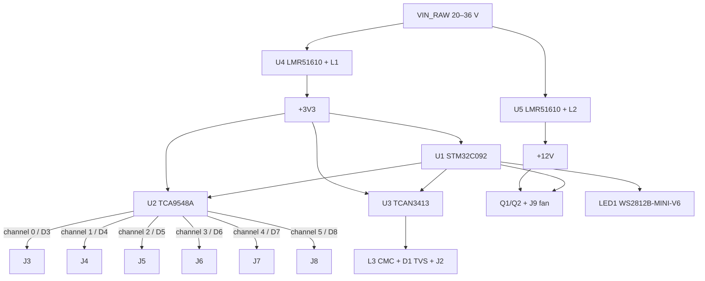

# CAN ↔ I2C Gateway — Rev A schematic implementation handoff

## 1. Design intent

Gateway PCB for:
- one CAN / CAN-FD connection;
- six external I2C target devices, connected through the backplane mate, which all use the same I2C address;
- one fixed 3-wire 12 V PC fan with supply-PWM speed control;
- one addressable RGB status LED;
- nominal input supply ~20–36 V;
- minimum unique pick/place BOM where reasonable.

### Canonical power architecture

Use two identical LMR51610YDBVR buck converters directly from VIN:

```
VIN_RAW (~20–36 V)
  |
  +-- U4 LMR51610YDBVR --> +3V3 --> MCU / I2C mux / CAN PHY / RGB LED
  |
  +-- U5 LMR51610YDBVR --> +12V --> fan
```

The previous +5 V rail, TLV75533 LDO, and NeoPixel level shifter are intentionally removed from the canonical design. LED1 is a WS2812B-MINI-V6 that operates directly from +3V3.

If a 5 V addressable LED is preferred instead, see Section 12.

---

## 2. Core BOM

| Ref(s) | Qty | MPN | LCSC | Package | Purpose | Population |
|---|---:|---|---|---|---|---|
| U1 | 1 | STM32C092GCU7 | — | UFQFPN-28 | MCU, FDCAN controller | POP |
| U2 | 1 | TCA9548APWR | C130026 | TSSOP-24 | 8-channel I2C mux | POP |
| U3 | 1 | TCAN3413DR | C22433320 | SOIC-8 | 3.3 V CAN-FD transceiver | POP |
| U4,U5 | 2 | LMR51610YDBVR | C22427220 | SOT-23-6 | 3.3 V and 12 V bucks | POP |
| LED1 | 1 | WS2812B-MINI-V6 | C52941386 | SMD3535-4P | 3.3 V addressable RGB status LED | POP |
| Q1 | 1 | AO3407A | C15155 | SOT-23 | P-MOS high-side 3-wire fan PWM | POP |
| Q2 | 1 | 2N7002,215 | C65189 | SOT-23 | Open-drain fan control / PMOS gate sink | POP |
| D1 | 1 | PESD2CANFD27V-TR | C552488 | SOT-23 | CAN/CAN-FD TVS | POP |
| L1,L2 | 2 | SRN6045TA-150M | C1330797 | 6 x 6 mm | 15 uH buck inductors | POP |
| L3 | 1 | ACT1210D-101-2P-TL00 | C3039743 | ACT1210 | CAN/CAN-FD common-mode choke | POP |

### Consolidated passives

| Ref(s) | Qty fitted | MPN | LCSC | Value | Purpose |
|---|---:|---|---|---|---|
| C1-C4,C6,C7,C10,C11,C16,C19 | 10 | CC0603KRX7R0BB104 | C113803 | 100 nF, 100 V, X7R, 0603 | universal bypass/bootstrap/reset capacitor |
| C5,C9,C17,C18 | 4 | C1206X225K101T | C106051 | 2.2 uF, 100 V, X7R, 1206 | buck/local VIN ceramic + input bulk ceramic |
| C8,C12-C15 | 5 | CL21A226MAYNNNE | C602037 | 22 uF, 25 V, X5R, 0805 | rail output/local bulk |
| R1,R2,R15,R16 | 4 | RC0603FR-074K7L | C99782 | 4.7 k, 1%, 0603 | upstream I2C, mux reset, fan tach pullups |
| R17,R19,R21,R22 | 4 | RC0603FR-0722K1L | C137768 | 22.1 k, 1%, 0603 | buck FB bottoms + fan gate pulls |
| R18 | 1 | RC0603FR-0769K8L | C137689 | 69.8 k, 1%, 0603 | +3V3 buck FB top |
| R20 | 1 | RC0603FR-07309KL | C273754 | 309 k, 1%, 0603 | +12V buck FB top |
| R24,R25 | 2 | RC0603FR-07120RL | C114640 | 120 ohm, 1%, 0603 | CAN termination + LED data series resistor |

### PCB-only / mechanical / not yet locked

| Ref | Purpose |
|---|---|
| J1 | GND/VIN input connector; mechanical series TBD |
| J2 | GND/CANL/CANH connector; mechanical series TBD |
| J11 | 2x7, 1.00 mm SMD socket backplane mate; mates with the backplane J8 pin header |
| J9 | Standard 3-position, 2.54 mm PC-fan header; supplier MPN TBD |
| J10 | SWD programming/debug connector/pads |
| SJ1 | CAN termination enable solder jumper |
| TP* | test pads |
| D2 | VIN TVS footprint, DNP/TBD until final supply max/tolerance is known |
| C20 | 10-47 uF, >=63 V input electrolytic footprint, DNP/TBD |

---

## 3. MCU pin allocation — U1 STM32C092GCU7, UFQFPN-28

| Pin | MCU pad | Net | Function / AF |
|---:|---|---|---|
| 1 | PC14-OSCX_IN | NC | no LSE crystal in Rev A |
| 2 | PC15-OSCX_OUT | NC | no LSE crystal in Rev A |
| 3 | VDD/VDDA | +3V3 | supply |
| 4 | VSS/VSSA | GND | ground |
| 5 | PF2-NRST | NRST | SWD reset |
| 6 | PA0 | FAN_CTRL | TIM2_CH1 / AF3 |
| 7 | PA1 | FAN_TACH | TIM17_CH1 / AF2 input capture |
| 8 | PA2 | LED_DATA | GPIO or TIM15_CH1 / AF8 |
| 9 | PA3 | NC | leave NC |
| 10 | PA4 | CAN_STB | GPIO |
| 11 | PA5 | NC | leave NC |
| 12 | PA6 | I2C_UP_SDA | I2C2_SDA / AF6 |
| 13 | PA7 | I2C_UP_SCL | I2C2_SCL / AF6 |
| 14 | PB0 | NC | leave NC |
| 15 | PB1 | NC | leave NC |
| 16 | PA8 | NC | leave NC |
| 17 | PC6 | NC | leave NC |
| 18 | PA11 [PA9] | CAN_RX | FDCAN1_RX / AF4 |
| 19 | PA12 [PA10] | CAN_TX | FDCAN1_TX / AF4 |
| 20 | PA13 | SWDIO | SWD |
| 21 | PA14-BOOT0 | SWCLK | SWD |
| 22 | PA15 | NC | leave NC |
| 23 | PB3 | NC | leave NC |
| 24 | PB4 | NC | leave NC |
| 25 | PB5 | NC | leave NC |
| 26 | PB6 | NC | leave NC |
| 27 | PB7 | NC | leave NC |
| 28 | PB8 | NC | leave NC |

Use the internal HSI clock for Rev A unless firmware accuracy requirements later justify a crystal.

---

## 4. Complete connectivity / pseudo-netlist

This is the schematic connectivity source of truth. Pin numbers are package pins.

### GND

Connect together:
- J1.1
- U1.4
- U2.12
- U3.2
- U4.2
- U5.2
- LED1.3
- Q2.2
- D1.3
- D3.3 through D8.3
- J2.1
- J3.1 through J8.1
- J9.1
- J10.1
- all capacitor ground terminals identified below
- all resistor ground terminals identified below

Use a continuous ground plane wherever possible.

### VIN_RAW

Connect:
- J1.2
- U4.5 VIN
- U4.4 EN
- U5.5 VIN
- U5.4 EN
- C5.1
- C6.1
- C9.1
- C10.1
- C17.1
- C18.1
- optional D2 VIN terminal
- TP_VIN

Connect C5.2, C6.2, C9.2, C10.2, C17.2, C18.2 to GND.

C5/C6 must sit immediately at U4 VIN/GND. C9/C10 must sit immediately at U5 VIN/GND. C17/C18 are power-entry bulk ceramics near J1.

### U4 +3V3 buck

`BUCK3V3_CB`
- U4.1 CB
- C7.1

`BUCK3V3_SW`
- U4.6 SW
- C7.2
- L1.1

`+3V3`
- L1.2
- C8.1
- C14.1
- U1.3
- U2.24
- U3.3 VCC
- U3.5 VIO
- C1.1
- C2.1
- C3.1
- C4.1
- LED1.1
- C16.1
- R1.1
- R2.1
- R15.1
- R16.1
- R3.1 through R14.1 if those resistors are populated
- J10.2
- TP_3V3

C8.2, C14.2, C1.2, C2.2, C3.2, C4.2, C16.2 -> GND.

`BUCK3V3_FB`
- U4.3 FB
- R18.2
- R17.1

R18.1 -> +3V3. R18 = 69.8 k.
R17.2 -> GND. R17 = 22.1 k.

### U5 +12V fan buck

`BUCK12_CB`
- U5.1 CB
- C11.1

`BUCK12_SW`
- U5.6 SW
- C11.2
- L2.1

`+12V`
- L2.2
- C12.1
- C13.1
- C15.1
- R20.1
- Q1.2 SOURCE
- R21.1
- TP_12V

C12.2, C13.2, C15.2 -> GND.

`BUCK12_FB`
- U5.3 FB
- R20.2
- R19.1

R20.1 -> +12V. R20 = 309 k.
R19.2 -> GND. R19 = 22.1 k.

### U1 local/reset/debug

`NRST`
- U1.5
- J10.5
- C19.1

C19.2 -> GND.

`SWDIO`
- U1.20
- J10.3

`SWCLK`
- U1.21
- J10.4

`SPARE_GPIO`
- U1.11
- TP_SPARE_GPIO

J10 suggested logical pinout:
1 GND
2 +3V3
3 SWDIO
4 SWCLK
5 NRST

### I2C upstream

`I2C_UP_SDA`
- U1.12
- U2.23 SDA
- R1.2

R1.1 -> +3V3.

`I2C_UP_SCL`
- U1.13
- U2.22 SCL
- R2.2

R2.1 -> +3V3.

### TCA9548A control/power

U2.1 A0 -> GND
U2.2 A1 -> GND
U2.21 A2 -> GND

This selects mux address 0x70.

`I2C_MUX_RESET_N`
- U1.9
- U2.3 RESET_N
- R15.2

R15.1 -> +3V3.

U2.24 -> +3V3
U2.12 -> GND
C2 = 100 nF directly adjacent to U2 supply pins.

### I2C channel 0

- U2.4 SD0 -> `SDA_SLOT_1` -> J11.13
- U2.5 SC0 -> `SCL_SLOT_1` -> J11.14

### I2C channel 1

- U2.6 SD1 -> `SDA_SLOT_2` -> J11.11
- U2.7 SC1 -> `SCL_SLOT_2` -> J11.12

### I2C channel 2

- U2.8 SD2 -> `SDA_SLOT_3` -> J11.9
- U2.9 SC2 -> `SCL_SLOT_3` -> J11.10

### I2C channel 3

- U2.10 SD3 -> `SDA_SLOT_4` -> J11.7
- U2.11 SC3 -> `SCL_SLOT_4` -> J11.8

### I2C channel 4

- U2.13 SD4 -> `SDA_SLOT_5` -> J11.5
- U2.14 SC4 -> `SCL_SLOT_5` -> J11.6

### I2C channel 5

- U2.15 SD5 -> `SDA_SLOT_6` -> J11.3
- U2.16 SC5 -> `SCL_SLOT_6` -> J11.4

J11.1 -> GND. J11.2 -> +3V3.

Per-slot I2C ESD protection and optional downstream pullups are implemented on the backplane PCB. Do not duplicate them on the backpack.

### Spare I2C mux channels

- U2.17 SD6 -> TP_I2C6_SDA
- U2.18 SC6 -> TP_I2C6_SCL
- U2.19 SD7 -> TP_I2C7_SDA
- U2.20 SC7 -> TP_I2C7_SCL

No pullups required unless these channels are actually used.

### CAN controller / transceiver

`CAN_TX`
- U1.19 PA12
- U3.1 TXD

`CAN_RX`
- U1.18 PA11
- U3.4 RXD

`CAN_STB`
- U1.10 PA4
- U3.8 STB

U3.2 -> GND
U3.3 VCC -> +3V3
U3.5 VIO -> +3V3

C3 = 100 nF from U3.3 VCC to GND, directly adjacent.
C4 = 100 nF from U3.5 VIO to GND, directly adjacent.

No external STB pull-up is required; TCAN3413 has an integrated pull-up and therefore defaults to standby while the MCU is uninitialized.

### CAN bus choke/protection/termination

`CANH_PHY`
- U3.7 CANH
- L3.1

`CANL_PHY`
- U3.6 CANL
- L3.2

TDK ACT1210D-101-2P-TL00 winding mapping:
- winding A: L3.1 <-> L3.4
- winding B: L3.2 <-> L3.3

`CANH_BUS`
- L3.4
- D1.1
- J2.3
- SJ1.1
- TP_CANH

`CANL_BUS`
- L3.3
- D1.2
- J2.2
- R24.2
- TP_CANL

D1.3 -> GND.

`CAN_TERM_SW`
- SJ1.2
- R24.1

R24 = 120 ohm.
SJ1 open by default; bridge only when this PCB is at a physical CAN bus endpoint.

J2:
1 GND
2 CANL_BUS
3 CANH_BUS

Layout order should be approximately U3 -> L3 -> connector region, with D1 located immediately beside J2 and with a very short transient path to the ground plane.

### Addressable RGB LED

`LED_DATA`
- U1.8 PA2
- R25.1

`LED_DIN`
- R25.2
- LED1.4 DIN

LED1.1 VDD -> +3V3
LED1.2 DOUT -> TP_LED_DOUT
LED1.3 VSS -> GND
LED1.4 DIN -> LED_DIN

C16 100 nF from +3V3 to GND, directly adjacent to LED1.
R25 = 120 ohm.

### Fan control — fixed 3-wire circuit

`FAN_CTRL`
- U1.6 PA0
- Q2.1 GATE
- R22.1

R22.2 -> GND. R22 = 22.1 k.
Q2.2 SOURCE -> GND.

`FAN_PGATE`
- Q2.3 DRAIN
- Q1.1 GATE
- R21.2

R21.1 -> +12V. R21 = 22.1 k.

Q1.2 SOURCE -> +12V
Q1.3 DRAIN -> `FAN_12V_SW`

`FAN_TACH`
- U1.7 PA1
- J9.3
- R16.2

R16.1 -> +3V3. R16 = 4.7 k.

`FAN_12V_SW`
- J9.2
- Q1.3 DRAIN

J9.1 -> GND.

#### Fan operation
- Q1 populated
- Q2 populated
- firmware PWM on PA0 at low supply-PWM frequency; ~30 Hz is a reasonable initial value to validate with the selected fan
- J9 pin 3 provides tach feedback

---

## 5. High-level topology



---

## 6. I2C implementation notes

- U2 address is fixed to 0x70 with A0/A1/A2 grounded.
- Firmware must enable only one of channels 0-5 at a time because all six targets share an address.
- Upstream R1/R2 4.7 k pullups are populated.
- The downstream mux channels connect directly to J11. Their per-slot ESD protection and optional pullups are on the backplane PCB.
- Do not add a common-mode choke to each I2C pair in Rev A. The bus is open-drain and rise-time/capacitance constrained. If a future link becomes long or noisy enough to need stronger conditioning, use a purpose-built I2C buffer/extender rather than an arbitrary CMC.

---

## 7. CAN implementation notes

- TCAN3413 runs VCC = 3.3 V and VIO = 3.3 V.
- Use both C3 and C4 local 100 nF decouplers.
- L3 is a CAN/CAN-FD-qualified common-mode choke.
- D1 is a CAN-FD TVS device and belongs at the connector side of L3, immediately beside J2.
- R24/SJ1 provide optional 120 ohm endpoint termination.
- Keep CANH/CANL tightly coupled and symmetric through L3/D1/J2.

---

## 8. Buck converter implementation notes

Both bucks intentionally use the same U and L part to reduce unique feeder count.

U4 +3V3:
- U4 = LMR51610YDBVR
- L1 = 15 uH
- R18/R17 = 69.8 k / 22.1 k
- C8 = 22 uF output at converter
- C14 = 22 uF local logic bulk

U5 +12V:
- U5 = LMR51610YDBVR
- L2 = 15 uH
- R20/R19 = 309 k / 22.1 k
- C12/C13 = 2 x 22 uF output at converter
- C15 = 22 uF local fan-header bulk

For both:
- C5 or C9 = 2.2 uF / 100 V immediately at VIN/GND
- C6 or C10 = 100 nF / 100 V immediately at VIN/GND
- C7 or C11 = 100 nF CB-to-SW bootstrap
- EN tied directly to VIN_RAW
- keep SW node physically small
- keep FB divider/trace away from SW and the inductor

The common 15 uH choice is an intentional BOM-consolidation compromise versus TI's nominal table values. The final engineer should preserve the 15 uH common part unless simulation/layout validation identifies a concrete regulation/transient issue for this application's ~20–36 V input and relatively light +3V3 load.

---

## 9. Suggested test pads

Provide at minimum:
- TP_VIN
- TP_3V3
- TP_12V
- TP_GND near power section
- TP_CANH
- TP_CANL
- TP_CAN_TX
- TP_CAN_RX
- TP_I2C_UP_SDA
- TP_I2C_UP_SCL
- TP_I2C6_SDA / TP_I2C6_SCL
- TP_I2C7_SDA / TP_I2C7_SCL
- TP_FAN_CTRL
- TP_FAN_TACH
- TP_LED_DATA
- TP_LED_DOUT
- TP_SPARE_GPIO

---

## 10. Population matrix

### Default assembly
- populate all core ICs;
- populate U4/U5, L1/L2 and all power passives;
- populate CAN L3, D1 and R24; leave SJ1 open;
- populate Q1/Q2;
- populate LED1;
- populate R1/R2/R15/R16;
- D2/C20 remain DNP until final power-source requirements are locked.

### 3-wire fan circuit
- Q1 POP
- Q2 POP
- J9 pin 2 permanently connected to `FAN_12V_SW`
- Q2 drain permanently connected to the Q1 gate

---

## 11. Input protection item intentionally left open

Do not finalize D2 until the maximum normal input voltage of the selected external supply is known, including tolerance. The LMR51610 itself has a wide input rating, but the TVS standoff and clamp must be selected so that:
- normal VIN never turns the TVS on continuously; and
- the TVS clamp remains comfortably below the buck IC absolute-maximum region under the intended surge waveform.

Leave footprints for:
- D2 high-energy input TVS;
- C20 10-47 uF >=63 V/100 V electrolytic/polymer as appropriate;
- optional input fuse/PTC/reverse-polarity element if the final connector/application calls for it.

---

## 12. Alternative if a 5 V NeoPixel-style LED is retained

If the design keeps a +5 V rail, a known LCSC pair is:
- U7: TI SN74AHCT1G125DBVR — LCSC C7484 — 3.3 V logic input to 5 V output buffer
- LED1: OPSCO SK6812MINI-E — LCSC C5149201 — 5 V addressable RGB LED

Suggested wiring:
- U7 VCC -> +5V
- U7 GND -> GND
- U7 /OE -> GND
- U1 LED_DATA -> U7 A
- U7 Y -> R25 120 ohm -> LED DIN
- 100 nF at U7 and LED

This alternative adds a +5 V regulator/rail and at least one additional active P&P feeder. The canonical Rev A therefore uses WS2812B-MINI-V6 at +3V3 and no level shifter.

---

## 13. Datasheets to use as schematic/footprint authority

Before symbol/footprint release, compare every library symbol against the current manufacturer datasheet for:
- ST STM32C091xB/xC / STM32C092xB/xC datasheet, TSSOP20 pinout and alternate-function tables
- TI TCA9548A datasheet
- TI TCAN3413/TCAN3414 datasheet
- TI LMR51610 datasheet
- TDK ACT1210D series datasheet
- Nexperia PESD2CANFD27V datasheet
- Worldsemi WS2812B-MINI-V6 datasheet
- AOS AO3407A datasheet
- Nexperia 2N7002 datasheet
