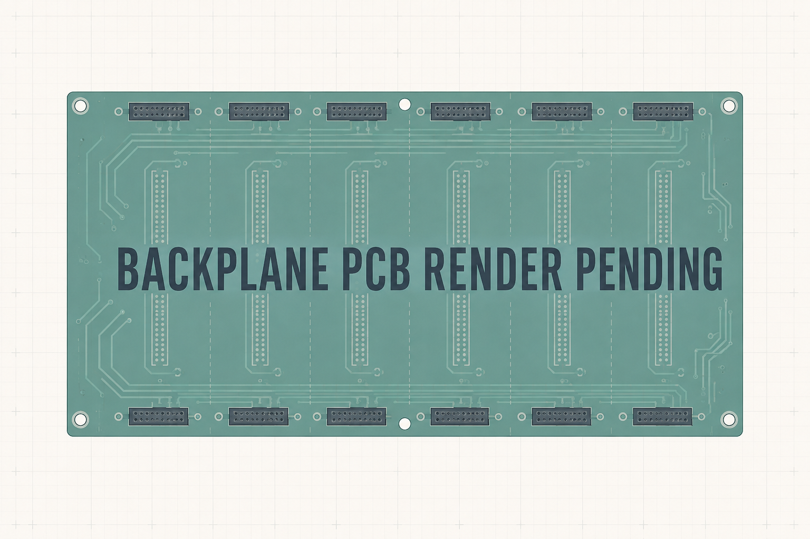

The second-generation backplane combines the controller and six-slot power
distribution on one PCB. The prototype board outline, airflow cutouts, mounting
features, and slot locations provide the mechanical foundation for the current
design.

_Placeholder illustration. Release tooling will replace this image with the
current PCB render._

## Responsibilities

- Accept the raw DC input and distribute `VIN_BUS` to six carrier slots.
- Measure aggregate input current across a 1 mΩ high-side shunt with an INA237.
- Provide a protected external CAN-FD connection and a shared bus to all slots.
- Generate local 3.3 V for control electronics and 12 V for cooling.
- Control two independent 3-wire fan power switches and read both tachometers.
- Support an externally powered DS18B20 temperature sensor.
- Expose SWD for controller programming and debug.

Each carrier slot has four electrical contacts: `VIN_BUS`, ground, CAN high,
and CAN low. There is no backplane-to-carrier I²C bus and no per-slot logic
supply.

## Status

The consolidated schematic has been synchronized into the PCB, but placement,
routing, high-current copper, regulator loops, CAN topology, thermal paths, and
test access still require release review. The current board must not be treated
as fabrication-ready merely because production-export tooling can generate an
archive.

Detailed implementation notes remain in the
[backplane README](https://github.com/kquinsland/modular-rack-power/blob/main/hardware/boards/backplane-prototype/README.md).
