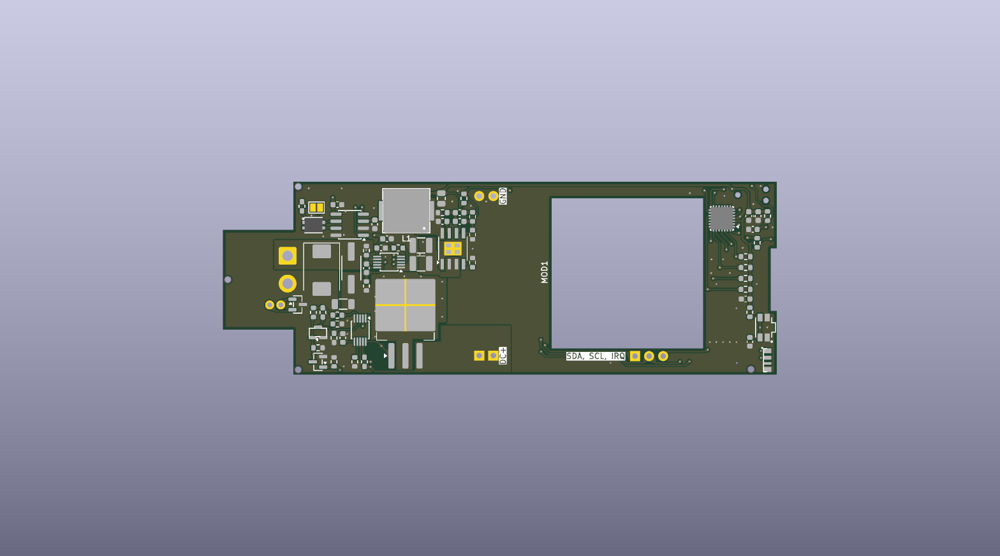
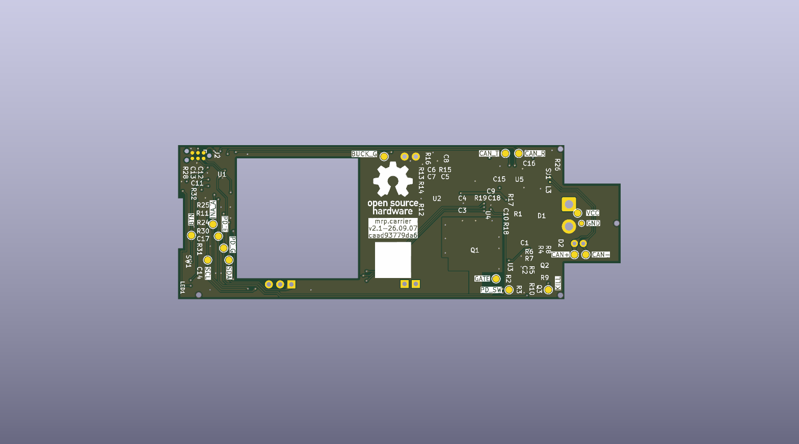

One carrier mates with each backplane slot and hosts one user-installed power
output module. It receives unswitched DC plus CAN-FD from the backplane and
generates its own 3.3 V housekeeping rail.

_Generated from the committed PCB. Render provenance is recorded in
[renders.json](renders.json); a preview does not establish fabrication readiness._

[Interactive assembly BOM](/assembly/carrier-ibom.html)

## Responsibilities

- Switch the high-current branch to the output module under local MCU control.
- Limit inrush and handle short-circuit, overload, undervoltage, and
  overvoltage conditions through dedicated hot-swap hardware.
- Measure module input voltage, current, and power with a local INA237.
- Communicate with the backplane over CAN-FD.
- Control the attached module through carrier-local I²C when required.
- Drive a local addressable status LED.
- Default the module power path off while the MCU is unpowered or resetting.

The carrier's housekeeping electronics connect ahead of the module current
shunt. Module telemetry therefore excludes the carrier controller, CAN
transceiver, and status LED consumption.

The initial population is operated as a nominal 24 V, 100 W system, with a
30 V maximum carrier input. This carrier is the limiting factor in the
24–48 V nominal backplane/system architecture. A second-generation carrier
with a suitably rated module and protection is required for 48 V input;
the current SW3538 population must not be tested at 48 V. Future 240 W
operation also requires a new end-to-end qualification.

See the detailed
[carrier hardware handoff](https://github.com/kquinsland/modular-rack-power/blob/main/hardware/boards/carrier/hardware-handoff.md)
for component-level design inputs and unresolved validation work.
