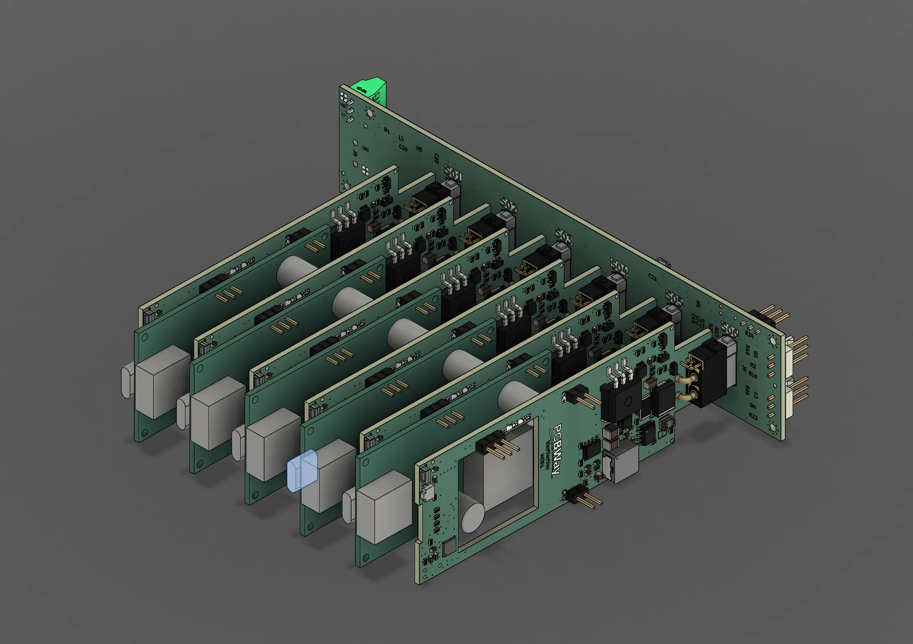
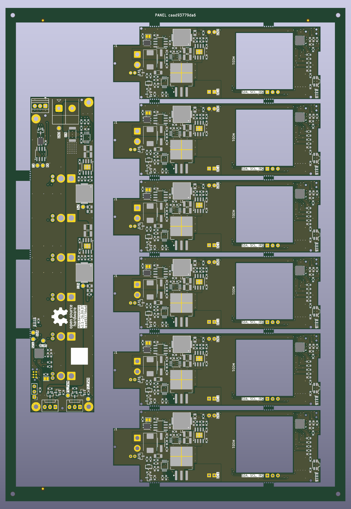

The current system has two custom PCB assemblies and one user-installed output
module. The backplane supplies shared infrastructure; each carrier owns its
local protection, measurement, control, and output module.

_Early mechanical concept image. A current assembly render will replace it as
the release pipeline is completed._

_Fabrication-panel preview, not an assembled-system model. See
[render provenance](_files/renders.json)._
